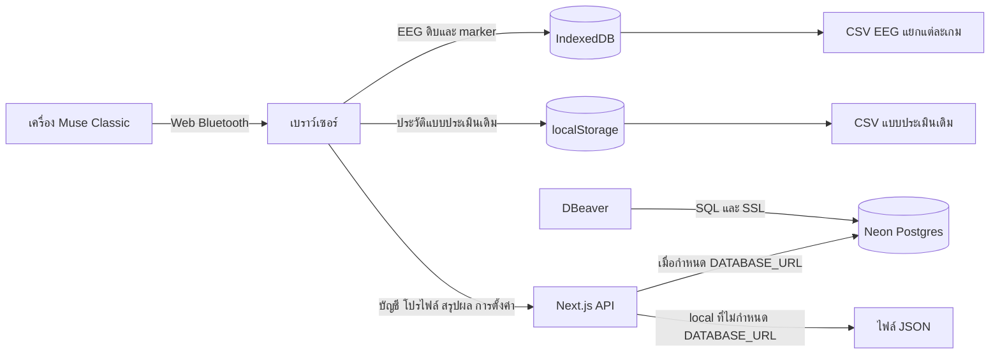

# คู่มือระบบ CogniLoad-XAI ภาษาไทย

คู่มือนี้อธิบายการทำงานจากโค้ดใน repository: หน้าจอสำหรับผู้ใช้งาน กระบวนการบันทึก EEG เกม แบบประเมิน สิทธิ์ผู้ใช้ ฐานข้อมูล API และการดูแลระบบ ตัวอย่างอีเมล รหัสผู้เข้าร่วม และข้อมูลในเอกสารเป็นข้อมูลสมมติ ไม่มีรหัสผ่านหรือ connection string ของระบบจริง

Source code: [tsuna-n/cogni](https://github.com/tsuna-n/cogni) · [ดาวน์โหลด ZIP](https://github.com/tsuna-n/cogni/archive/refs/heads/main.zip)

อ้างอิงพฤติกรรมโค้ดที่ commit [`cee4676`](https://github.com/tsuna-n/cogni/commit/cee4676) ซึ่งรวมการแก้เชื่อมต่อ Classic Muse แล้ว เมื่อระบบเปลี่ยนภายหลังให้ตรวจโค้ด/การตั้งค่าของ deployment ที่ใช้งานร่วมกับคู่มือ ไม่ใช้ตัวเลขตัวอย่างแทนค่าจริง

## สารบัญและวิธีเลือกอ่าน

| บท | เนื้อหา | เหมาะสำหรับ |
| --- | --- | --- |
| [คู่มือการใช้งานทุกหน้า](user-manual.th.md) | สมัคร/เข้าสู่ระบบ Dashboard ข้อมูลผู้ใช้ MMSE ห้องทดลอง เกม ประวัติ และหน้า Admin | ผู้ใช้ นักวิจัย ผู้ดูแล |
| [EEG เกม และรูปแบบข้อมูล](eeg-and-data.th.md) | การเชื่อม Muse ลำดับทดลอง marker เวลา CSV คุณภาพสัญญาณ และการกู้ข้อมูล | นักวิจัย ผู้วิเคราะห์ข้อมูล นักพัฒนา |
| [ฐานข้อมูลและ DBeaver](database-admin.th.md) | ตาราง/คอลัมน์ JSONB การเพิ่มบัญชีและสิทธิ์ การเปลี่ยนรหัสผ่าน SQL และการสำรองข้อมูล | ผู้ดูแลฐานข้อมูล |
| [โครงสร้างโค้ดและ API](architecture-and-api.th.md) | หน้าที่ไฟล์ การไหลข้อมูล session การตรวจสิทธิ์ API ทุก endpoint และส่วนที่ยังเป็นต้นแบบ | นักพัฒนา ผู้รับช่วงโปรเจกต์ |
| [ติดตั้ง ตั้งค่า และ deploy](development-and-deployment.th.md) | เปิดโปรเจกต์ environment ทดสอบ Vercel ย้าย JSON ไป Neon และแนวทางดูแลระบบ | นักพัฒนา ผู้ดูแล |
| [แก้ปัญหาและตรวจรับระบบ](troubleshooting.th.md) | Muse เชื่อมไม่ได้ EEG ไม่ครบ sync ไม่ผ่าน login/DB/profile error และตัวอย่างตรวจรับ | ทุกบทบาท |
| [ภาพรวมโปรเจกต์และฐานข้อมูลฉบับย่อ](project-and-database.th.md) | โครงสร้างและ DBeaver แบบอ่านเร็ว | ผู้เริ่มต้น |

ผู้ใช้ใหม่ควรอ่านภาพรวมในหน้านี้ แล้วทำตามคู่มือการใช้งาน นักวิจัยที่จะเก็บข้อมูลควรอ่านบท EEG และรูปแบบข้อมูลเพิ่ม ผู้ดูแลที่ต้องเพิ่ม admin/researcher เริ่มจากบทฐานข้อมูล ผู้รับช่วงพัฒนาควรอ่านบทโครงสร้างโค้ดและบทติดตั้งร่วมกัน

## ระบบนี้ทำอะไร

CogniLoad-XAI เป็นพื้นที่วิจัยผ่านเว็บสำหรับเชื่อม Muse 2 / Muse S ที่ใช้ Classic protocol รับ EEG สี่ช่อง TP9, AF7, AF8 และ TP10 ที่อัตราตามโปรโตคอล 256 samples/วินาที/ช่อง ทดลองสามเกม และบันทึกเหตุการณ์ให้ตรงกับช่วงเวลา baseline → task → rest

นักวิจัยกรอกรหัสผู้เข้าร่วมและรหัสชุดทดลอง จากนั้นระบบบันทึกเกม 1 → 2 → 3 โดยแต่ละเกมมี baseline/task/rest และไฟล์ EEG ของตัวเอง มี Dashboard แสดงข้อมูลบัญชี/โปรไฟล์และผลสรุปที่ sync แล้ว ส่งออก CSV เพื่อวิเคราะห์ภายนอกได้ รองรับภาษาไทยและอังกฤษ

ส่วน ML, preprocessing, feature extraction และ XAI ที่เหลืออยู่ในโค้ดเป็นตัวอย่าง ยังไม่มีโมเดลที่ฝึกจากข้อมูลจริงหรือการทำนายจาก EEG ที่บันทึก ระบบคำนวณจำนวน sample เวลา คุณภาพเบื้องต้น และผลเกมได้จริง แต่ผลเหล่านี้ไม่ใช่การวินิจฉัยโรค

## ภาพรวมการไหลของข้อมูล

## ข้อมูลแต่ละชนิดอยู่ที่ไหน

| ข้อมูล | ที่เก็บ | ดูจากเครื่องอื่นได้ไหม | วิธีนำออก |
| --- | --- | --- | --- |
| บัญชี รหัสผ่านที่ hash แล้ว role ประวัติ login ฝั่ง server | Neon หรือ `users.json` | ได้เมื่อใช้ backend เดียวกันและมีสิทธิ์ | DBeaver/การสำรองฐานข้อมูล |
| โปรไฟล์ผู้ใช้และคะแนน MMSE ใน Dashboard | `cogniload_users.profile` หรือ `profile` ใน JSON | ได้ตามสิทธิ์ admin/researcher | ดูใน Dashboard หรือ export ข้อมูลตารางผ่าน DBeaver |
| EEG ดิบและ marker ของรอบทดลอง | IndexedDB ของ origin และ browser profile ที่บันทึก | ต้องส่งออกไฟล์จากเครื่องเดิม | CSV EEG |
| สรุปแต่ละรอบก่อน sync | IndexedDB | ยังไม่ได้จนกว่าจะ sync | CSV สรุปใน Dashboard ข้อมูลในเครื่อง |
| สรุปที่ sync แล้ว | `cogniload_research_records` หรือ JSON สรุป | ได้ตามสิทธิ์บัญชี | CSV สรุปผล/SQL |
| เวลาทดลองและ protocol ที่ admin บันทึก | `cogniload_settings` หรือ JSON การตั้งค่า | ใช้ร่วมกันผ่าน backend | SQL/สำรองข้อมูล |
| แบบประเมิน/เกมตามเครื่องมือเดิม | localStorage แยก key ตามอีเมล | ไม่ย้ายตามบัญชีอัตโนมัติ | `CogniLoad_assessment_export.csv` |
| ภาษาและ Muse device ID ล่าสุด | localStorage | เฉพาะเบราว์เซอร์นั้น | ตั้งค่าใหม่ได้ |

การ login ด้วยอีเมลเดียวกันที่อีกเครื่องช่วยเปิดข้อมูลบน server ได้ แต่ไม่ย้าย raw EEG หรือแบบประเมินเดิมไปเครื่องใหม่ `localhost` กับเว็บ HTTPS ที่ deploy แล้วก็เป็นคนละ origin และใช้ IndexedDB/localStorage คนละชุด แม้จะเปิดบนเครื่องเดียวกัน

## สิทธิ์ตามโค้ดปัจจุบัน

| การทำงาน | `user` | `researcher` | `admin` |
| --- | --- | --- | --- |
| Login ใช้ห้องทดลองและฝึกเกม | ได้ | ได้ | ได้ |
| บันทึก/ส่งออก EEG ของบัญชีตนเองในเบราว์เซอร์ | ได้ | ได้ | ได้ |
| ส่งสรุปของตนเองและอ่านสรุปที่ตนเองส่งผ่าน API | ได้ | ได้ | ได้ |
| Dashboard รายชื่อและโปรไฟล์ทุกบัญชี | ไม่ได้ | ได้ | ได้ |
| แก้ชื่อ ข้อมูลผู้เข้าร่วม MMSE และหมายเหตุทุกบัญชี | ไม่ได้ | ได้ | ได้ |
| Dashboard สรุปที่ sync ของทุกบัญชี | ไม่ได้ | ได้ | ได้ |
| หน้า Admin และ API ค้นรายรหัสผู้เข้าร่วม | ไม่ได้ | ไม่ได้ | ได้ |
| เปลี่ยนเวลาทดลอง/คืนค่าเซิร์ฟเวอร์ | ไม่ได้ | ไม่ได้ | ได้ |
| รับช่วงรอบ EEG เก่าในเครื่องที่ไม่มีเจ้าของ | ไม่ได้ | ไม่ได้ | ได้ |
| เปลี่ยน role ผ่านหน้าเว็บ | ไม่มีฟังก์ชัน | ไม่มีฟังก์ชัน | ไม่มีฟังก์ชัน |

ฟอร์ม Register สร้าง `user` เสมอ การสร้าง/ยกระดับบัญชีเป็น `researcher` หรือ `admin` ทำในฐานข้อมูลโดยผู้ที่มีสิทธิ์เชื่อม DB การมี role เป็น admin ในเว็บไม่ได้ให้รหัสผ่าน PostgreSQL แก่ผู้ใช้โดยอัตโนมัติ

ห้องทดลองในโค้ดเปิดให้บัญชีที่ login ทุก role ใช้ได้ การแบ่ง role จำกัดการจัดการข้อมูลรวมและการตั้งค่า หากโครงการต้องการให้เฉพาะนักวิจัยบันทึก EEG ต้องปรับนโยบายและโค้ดเพิ่มเติม

## ตัวอย่างการทำงานตั้งแต่ต้นจนจบ

1. ผู้ดูแลเพิ่มบัญชีนักวิจัยและกำหนด `role='researcher'` ใน Neon/DBeaver
2. นักวิจัย login เปิด Dashboard → ผู้ใช้ กรอกโปรไฟล์ให้บัญชีที่ต้องการ เช่น `participantId=P001`
3. เปิดห้องทดลอง EEG กรอก `P001`, รหัสชุด `S01`, กลุ่มวิจัย เงื่อนไข เวลากิจกรรม และยืนยันความยินยอม
4. กดเชื่อมต่อ Muse รอ EEG ครบสี่ช่อง แล้วทดสอบอุปกรณ์ 15 วินาทีตามความเหมาะสม
5. เริ่มชุดทดลอง เกมแรกเก็บ `S01-G1` ต่อเนื่องทั้งสามช่วง กด Next เพื่อจบ Task และรอ Rest ให้บันทึกเสร็จ
6. กด Next เริ่มเกม 2 และเกม 3 ได้ `S01-G2` และ `S01-G3` แต่ละเกมเก็บเป็นคนละ record UUID
7. ส่งออก EEG ของแต่ละเกม ตรวจไฟล์ใน Downloads และตรวจ marker/คุณภาพด้วย script ของโปรเจกต์
8. ตรวจสถานะ sync ของผลสรุป เปิด Dashboard → ผลการทดลอง เพื่อเปรียบเทียบรอบ หรือให้ admin ค้น `P001`
9. สำรอง CSV EEG และสรุป หากต้องลดพื้นที่ในเครื่องใช้ “ลบ EEG ดิบ เก็บสรุป” หลังตรวจไฟล์แล้ว

โปรไฟล์บน Dashboard กับข้อมูลที่กรอกเริ่มรอบ EEG เป็นข้อมูลคนละชุด ไม่มีการนำโปรไฟล์มาเติมฟอร์มทดลองให้อัตโนมัติ ต้องใช้รหัสให้ตรงกันเอง หนึ่งบัญชีสามารถบันทึกหลายรหัสผู้เข้าร่วมได้ แต่โปรไฟล์บัญชีมีรหัสผู้เข้าร่วมหนึ่งช่อง จึงไม่ใช่ทะเบียนผู้เข้าร่วมแบบหลายโปรไฟล์ต่อบัญชี

## คำศัพท์ที่ใช้ในคู่มือ

| คำ | ความหมายในระบบ |
| --- | --- |
| Account / บัญชี | ตัวตนที่ login ด้วยอีเมล มีรหัสผ่านและ role |
| Participant ID | รหัสแทนผู้เข้าร่วม เช่น `P001` ไม่ใช่ email |
| Base session ID | รหัสชุดทดลองที่กรอก เช่น `S01` |
| Game session ID | รหัสของเกมในชุด เช่น `S01-G1` |
| Record ID | UUID ที่ระบุการบันทึกหนึ่งครั้ง แม้ retry เกมเดิมก็ได้ UUID ใหม่ |
| Sequence ID | UUID ของชุดสามเกม ใช้ตรวจลำดับและการทำต่อในเครื่อง |
| Baseline | ช่วงพักนิ่งก่อนทำกิจกรรมของแต่ละเกม |
| Task | ช่วงเกมที่บันทึกสิ่งเร้า/การตอบ |
| Rest | ช่วงพักหลังเกมที่ยังรับ EEG ต่อ |
| Sample | ค่า EEG หนึ่งจุดของหนึ่งช่อง |
| Packet | ชุดข้อมูล Bluetooth; EEG Classic หนึ่ง packet มี 12 sample ของหนึ่งช่อง |
| Marker | แถวเหตุการณ์พร้อมเวลา เช่น `task_start` |
| Summary sync | ส่งเฉพาะผลสรุปขึ้น server ไม่ส่ง EEG ดิบ |
| Profile revision | เวลาแก้ล่าสุด ใช้ป้องกันการบันทึกทับโดยไม่รู้ตัว |

## ขอบเขตและสิ่งที่ต้องเข้าใจร่วมกัน

- ข้อมูลทางสถิติใน Dashboard มาจากข้อมูลที่บันทึกจริงตามเงื่อนไขของกราฟ ช่องว่าง/รอบไม่ครบ/รอบทดสอบอุปกรณ์มีความหมายต่างกัน
- สถานะ `complete` หมายถึงบันทึกครบช่วง ไม่รับรองว่าไม่มี clipping/packet gap หรือสัญญาณเหมาะกับการวิเคราะห์ทุกประเภท
- ค่า 256 Hz เป็นค่าตามโปรโตคอล ตัวเลข Hz ที่คำนวณจากข้อมูลเป็นอัตราที่สังเกตได้และอาจต่ำลงจากข้อมูลขาด
- การลบข้อมูลในเครื่องไม่ลบ summary ที่ sync ไป server แล้ว และ server ไม่มี EEG ดิบให้ดาวน์โหลดกลับ
- เบราว์เซอร์ที่แชร์กันสามารถเข้าถึงข้อมูล raw ใน browser profile เดียวกันได้ แม้แอปกรองรายการตามเจ้าของ ควรใช้ browser/OS profile แยกสำหรับเครื่องเก็บข้อมูล
- Manifest/service worker มีไว้ช่วยติดตั้งและ cache asset บางรายการ ไม่ได้ทำให้ login, sync หรือเริ่มรอบใหม่ทำงาน offline ได้ครบ

รายละเอียดของข้อจำกัด วิธีใช้งาน และจุดที่ต้องตรวจสอบอยู่ในแต่ละบทด้านบน

## ขอบเขตการตรวจเอกสาร

ตรวจรายชื่อ API ครบ 14 คู่ method/path จาก route handlers คอลัมน์ raw CSV ครบ 25 และ summary CSV ครบ 34 จาก exporter จริง ตรวจ relative links และ syntax ของ JSON/shell examples ตัวอย่างโปรไฟล์/settings ผ่าน validator ของโปรเจกต์ คำสั่งสร้าง password hash ทดลองด้วยข้อมูลสมมติและ verify ได้ และ migration dry run ตรวจใน fixture แยกโดยไม่เขียนฐานข้อมูลจริง

ตัวอย่าง SQL ในบท DB อธิบายเพื่อให้ผู้ดูแลเลือก environment/แถวก่อนรัน ไม่ได้รัน INSERT/UPDATE/restore ใน Production เพื่อจัดทำคู่มือนี้ การตรวจเอกสารไม่ทดแทน automated tests/hardware checks ของโค้ดหรือการตรวจรับ deployment ใหม่
