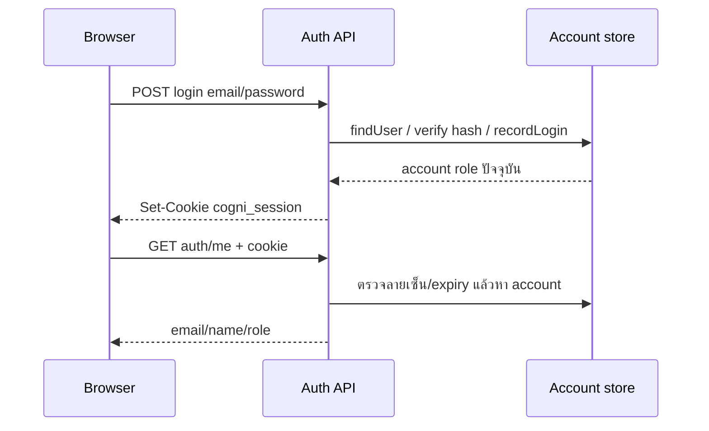

# โครงสร้างโค้ดและ API

[สารบัญคู่มือ](README.md) · [ฐานข้อมูล](database-admin.th.md) · [ติดตั้งและทดสอบ](development-and-deployment.th.md)

## 1. Stack และขอบเขตการทำงาน

ค่าที่ระบุใน `package.json` คือ Next.js 16.3.5, React/React DOM 19.2.8, muse-jsx `^0.3.1` และ @neondatabase/serverless `^1.1.0` ใช้ App Router, JavaScript/JSX และ CSS ของโปรเจกต์ ไม่มี service แยกสำหรับ Python/ML ใน repository นี้

`app/layout.js` ตั้ง metadata, manifest, font และ styles หน้า `app/page.js` เป็น Client Component มี state/auth UI, เมนู, legacy assessment และ Muse integration Browser API เช่น navigator.bluetooth, IndexedDB, localStorage และ canvas ทำงานจาก effects/events ฝั่ง client ส่วน API route และ lib storage/auth ทำงานบน server

หน้าใช้งานหลักอยู่ URL `/` และสลับ `<section>` ด้วย state/DOM ไม่ได้มี route `/dashboard` หรือ `/admin` ของหน้าจอแยกกัน คำว่า Admin/Dashboard ในคู่มือหมายถึงเมนูในแอป ยกเว้น `/api/admin/...` ซึ่งเป็น HTTP route จริง

ก่อนแก้ Next APIs ให้ตรวจ guide ใน `node_modules/next/dist/docs/` ตาม AGENTS.md รุ่นนี้ เช่น cookies เป็น async และ route params รับแบบ Promise แล้ว `await params` อย่าย้ายตัวอย่างจาก Next รุ่นเก่ามาใช้โดยไม่ตรวจ

## 2. หน้าที่ไฟล์

| ตำแหน่ง | ความรับผิดชอบ |
| --- | --- |
| `app/page.js` | Auth form/session restore, shell/navigation, Muse driver/จอสด, เกม, legacy assessment, demo sections และเชื่อม components |
| `app/layout.js` | Root layout, metadata, fonts, global styles |
| `app/globals.css` | Styles ราก/การทดลอง/ส่วนเดิม รวมการซ่อน baseline เดี่ยว |
| `app/dashboard.css`, `app/workspace.css` | Dashboard และ workspace/mobile layout |
| `app/components/ResearchSession.js` | Precheck, phase timer, raw recorder, sequence/retry, export/prune/recovery/sync |
| `app/components/GameSequenceControls.js` | แถบสามเกม Next/จบ Task/retry/ส่งออก/ดูผล |
| `app/components/researchStorage.js` | IndexedDB transactions, sessions/chunks, claim, raw prune และ sync metadata |
| `app/components/ResearchDashboard.js` | Personal/local charts, filters, calendar, backfill summary |
| `app/components/ResearchHistory.js` | ตารางสรุป, comparison และ CSV สำหรับทั้ง local/server |
| `app/components/DashboardUsers.js` | โหลด users/summary, tabs, filters, draft, revision save |
| `app/components/DashboardUserOverview.js` | กราฟ/รายการจาก server profiles |
| `app/components/DashboardUserEditor.js` | ฟอร์ม profile/MMSE/notes |
| `app/components/AdminPanel.js` | Settings และ summary ราย participant สำหรับ admin |
| `app/components/WorkspacePageHeading.js`, `DashboardIcon.js` | Heading และ SVG icons ที่ใช้ร่วมกัน |
| `app/components/BleDevicesPanel.js` | Component Heart Rate/IoT BLE ที่มีโค้ดอยู่ แต่ยังไม่ถูก import/render ในหน้าปัจจุบัน |
| `lib/muse/eeg-client.mjs` | Classic packet decoder, EEG-only client adapter, discovery retry และข้อความ error |
| `lib/eeg-signal-quality.mjs` | สถิติหน้าต่าง EEG/องค์ประกอบ 50 Hz |
| `lib/research-summary.mjs` | สรุปเวลา/counts และ parse game end marker |
| `lib/dashboard/user-overview.mjs` | Filter accounts, counts, age bands, completed MMSE |
| `lib/localization.js`, `lib/th-dict.js` | แปลข้อความ/DOM ส่วนเดิมและภาษาไทย |
| `lib/auth/password.js` | Hash/verify scrypt |
| `lib/auth/session.js` | HMAC cookie, expiry, signing secret |
| `lib/auth/store.js` | Account CRUD ที่ใช้จริง: find/create/login/list/profile update พร้อม SQL/JSON |
| `lib/auth/roles.mjs`, `authorization.js` | อ่าน role จาก store และปฏิเสธ API ตามสิทธิ์ |
| `lib/auth/user-profile.mjs` | Profile validation และ MMSE domain totals |
| `lib/auth/rate-limit.js` | SQL/Map counters และ IP buckets |
| `lib/server-database.js` | Neon client/schema initialization |
| `lib/server-config.js` | Environment defaults/data paths/study validation |
| `lib/research/server-store.js` | Summary storage, ownership conflict, list/filter participants |
| `lib/research/validation.js` | Normalize finalized summary ที่รับผ่าน API |
| `lib/research/study-settings-store.js` | Saved study config มาก่อน defaults พร้อม reset |
| `lib/research/game-sequence.mjs`, `local-ownership.mjs` | ลำดับเกม/session IDs และ owner filtering |
| `scripts/validate-muse-csv.mjs` | ตรวจ raw CSV เป็น JSON report |
| `scripts/migrate-local-json.mjs` | Dry run/import JSON account/summary/settings เข้า Neon |
| `tests/*.test.mjs` | Unit/store/API tests |
| `public/sw.js`, `manifest.webmanifest`, `icon.svg` | Install support และ static cache |
| `settings.example.env` | ตัวอย่าง server settings ไม่มี secrets จริง |
| `vercel.json` | เลือก installCommand `npm ci` |
| `next.config.mjs`, `jsconfig.json` | Next config และ alias `@/*` มาที่ root |
| `package-lock.json`, `pnpm-lock.yaml` | Dependency lockfiles; Vercel ใช้ npm lock |
| `docs/` | คู่มือภาษาไทยและการส่งมอบระบบ |

## 3. การยืนยันตัวตน



Cookie `cogni_session` เก็บ payload email/exp แบบ base64url ลงลายเซ็น HMAC-SHA256 อายุเจ็ดวัน ใช้ HttpOnly, SameSite=Lax, Path=/ และ Secure เมื่อ NODE_ENV=production Payload ไม่ได้เก็บ role เป็นสิทธิ์ที่เชื่อถือได้

`authorizeUser()` ตรวจ cookie แล้วอ่านบัญชีจาก store ทุกครั้ง Role ที่หาย/ไม่รู้จัก default เป็น user; `manageUsers` รับ admin/researcher; `adminOnly` รับ admin เท่านั้น การส่ง role/email ปลอมใน request ไม่เปลี่ยนผู้ใช้ที่ authorize ได้

API ข้อมูลส่วนตัวหลักใช้ `Cache-Control: private, no-store` Session ไม่ใช่ session row ใน DB และไม่มี password-reset invalidation field เปลี่ยน role/ลบบัญชีมีผลกับสิทธิ์ทันทีในคำขอถัดไป แต่เปลี่ยน password hash ไม่ยกเลิก cookie เดิม

## 4. Browser storage และ event flow

| ที่เก็บ/key | ใช้ทำอะไร |
| --- | --- |
| IndexedDB `cogniload-muse-research` | sessions/chunks ของ ResearchSession |
| `cogni_locale` ใน localStorage | ภาษา th/en |
| `museLastDeviceId` | เครื่องที่เคยเลือกเพื่อ reconnect |
| `cogni_progress_<email>` | Journey/แบบประเมินเดิมที่ทำค้าง |
| `cogni_assessments_<email>` | ประวัติแบบประเมินเดิม |
| `cogni_logins_<email>` | ประวัติ login ในเครื่อง สูงสุด 100 รายการ |
| `cogni_login`, `cogni_name` ใน sessionStorage | ตัวตนที่ UI เดิมใช้; ไม่ใช่แหล่ง authorize server |

หน้าใหญ่ยังใช้ global functions บน window สำหรับ handlers ที่สร้างด้วย innerHTML และ CustomEvents เชื่อม React กับเกม/Muse ต้องระวังถ้า refactor ให้คงความหมายและ cleanup listeners:

| Event | ผู้ส่ง → ผู้รับ | จุดประสงค์ |
| --- | --- | --- |
| `muse-study-reading` | Muse subscriber → ResearchSession | packet เพื่อ counters/raw |
| `muse-study-status` | Muse UI → ResearchSession | reset readiness และหยุด disconnect |
| `research-task-start` | ResearchSession → เกมใน page | เปิดหน้าเกมและเริ่ม selected game |
| `research-task-marker` | เกม → ResearchSession | stimulus/response/end summary |
| `research-task-complete` | ปุ่มจบ Task → ResearchSession | เข้า Rest |
| `research-task-ended` | Recorder → เกม | หยุดเกม/timer และทำ end marker |
| `research-task-screen-left` | Navigation → Recorder | หยุดเมื่อออกระหว่าง Task |
| `research-sequence-state` | Recorder → page | UI ของชุดสามเกม |
| `research-session-finished` | Recorder หลัง persist → dashboard/sync | refresh หลังรอบลงเครื่องสำเร็จ |
| `research-dashboard-opened` | Navigation → dashboard | โหลดข้อมูลล่าสุด |
| `research-summary-select` | ปุ่มดูสรุป → history | เลือกรอบเปรียบเทียบ |
| `study-config-updated` | Settings/config check → page | reload public study config |

Window fields เช่น `__studyPhase`, `__studyGameId`, `__studySequence`, `__studyUnexported`, `__museReady` มีไว้ประสาน client UI ไม่ได้เป็นหลักฐานสิทธิ์ใน API

## 5. API ทุก endpoint

API อยู่ same origin ใช้ cookie ที่ login แล้ว JSON keys เป็นภาษาอังกฤษและไม่เปลี่ยนตาม locale Client ควรตรวจ HTTP status ก่อนอ่าน payload

| Method/path | สิทธิ์ | Input | Success |
| --- | --- | --- | --- |
| `GET /api/config` | Public | ไม่มี | `{registrationEnabled, study}` |
| `POST /api/auth/register` | Public เมื่อ enabled | `{email,password,name?}` | 201 `{user:{email,name,role:'user'}}` + cookie |
| `POST /api/auth/login` | Public | `{email,password}` | 200 `{user:{email,name,role}}` + cookie |
| `GET /api/auth/me` | Login | cookie | 200 `{user}`; unauthorized `{user:null}` |
| `POST /api/auth/logout` | ลบ cookie ปัจจุบัน | ไม่มี | `{ok:true}` |
| `GET /api/dashboard/users` | researcher/admin | ไม่มี | `{users:[...]}` |
| `PUT /api/dashboard/users/[email]` | researcher/admin | `{name,profile,expectedUpdatedAt}` | `{user:...}` |
| `GET /api/research/summaries` | Login | ไม่มี | `{records:[...]}`: user เฉพาะตน, staff ทุกบัญชี |
| `POST /api/research/summaries` | Login | `{recordId,summary}` | `{recordId,uploadedAt,uploadedBy}` |
| `GET /api/admin/participants?q=...` | admin | คำค้น ≤40 ตัวอักษร | `{participants:[{id,sessionCount}]}` |
| `GET /api/admin/participants/[id]` | admin | รหัส ≤40 ตัวอักษร | `{records:[...]}` |
| `GET /api/admin/settings` | admin | ไม่มี | `{study,source}` |
| `PUT /api/admin/settings` | admin | study fields ห้าตัว | `{study,source:'saved'}` |
| `DELETE /api/admin/settings` | admin | ไม่มี | `{study,source:'environment'}` |

ไม่มี endpoint สำหรับ role assignment, create staff, change password, delete account, upload/download raw EEG หรือ server-summary delete

### Managed user response

```json
{
  "email": "participant@example.org",
  "name": "Participant",
  "role": "user",
  "createdAt": "2026-10-01T00:00:00.000Z",
  "loginCount": 2,
  "lastLoginAt": "2026-10-01T01:00:00.000Z",
  "profile": {"participantId": "P001"},
  "profileUpdatedAt": null,
  "profileUpdatedBy": null
}
```

Response นี้ไม่มี passwordHash/password_hash/session secret; profile ส่งเฉพาะ keys ที่รองรับ

### Profile update request

```json
{
  "name": "Participant",
  "expectedUpdatedAt": null,
  "profile": {
    "participantId": "P001",
    "age": 65,
    "hand": "Right",
    "sessionId": "S01",
    "studyGroup": "control",
    "education": "primary",
    "mmseScores": [5, 5, 3, 4, 2, 6, 2, 1],
    "notes": "นัดติดตามผล"
  }
}
```

`expectedUpdatedAt` ต้องเป็น revision ปัจจุบันจาก GET หรือ null ก่อนเคยบันทึก ใช้ WHERE เปรียบเทียบ revision แบบ NULL-safe SQL และตรวจแบบเดียวกันใน JSON store ถ้าข้อมูลถูกแก้ก่อนแล้วคืน 409 profile_conflict ไม่เขียนทับ Draft ต้องโหลดล่าสุดแล้ว merge โดยผู้ใช้

### Summary response

```json
{
  "recordId": "00000000-0000-4000-8000-000000000001",
  "participantId": "P001",
  "uploadedBy": "researcher@example.org",
  "uploadedAt": "2026-10-01T01:02:00.000Z",
  "summary": {"version": 1, "status": "complete"}
}
```

นี่เป็นตัวอย่าง response ที่ย่อ summary เพื่ออธิบาย envelope ไม่ใช่ POST payload ที่สมบูรณ์ ต้องส่งทุก summary field ตาม [รูปแบบข้อมูล](eeg-and-data.th.md)

### Guards และ error ที่ใช้งาน

Profile PUT และ summary POST ต้องเป็น JSON guard ขนาด 16,384 ทั้ง Content-Length และ raw text length ตรวจ Origin เมื่อ header มีอยู่ให้ตรง host/protocol Settings PUT ใช้ 4,096 และ PUT/DELETE ตรวจ Origin เช่นกัน API normalize ตัด field ที่ไม่รับใน summary และปฏิเสธ unknown profile fields เพื่อไม่ให้แก้ role/credentials แฝง

| HTTP | Error ตัวอย่าง | ความหมาย/แก้ไข |
| --- | --- | --- |
| 400 | invalid_body/invalid_settings/invalid_email/weak_password | แก้รูปแบบ/ช่วงค่า อ่าน detail ถ้ามี |
| 401 | unauthorized/invalid_credentials | ไม่มี session/account หรือ login ไม่ผ่าน |
| 403 | forbidden/registration_disabled | ไม่มี role ที่ต้องใช้, origin ไม่ตรง หรือปิด Register |
| 404 | not_found | บัญชีเป้าหมายไม่มี |
| 409 | email_taken/profile_conflict/record_conflict | email ซ้ำ, revision เก่า, หรือเจ้าของ/rหัส record ไม่ตรง |
| 413 | invalid_body | payload ใหญ่เกิน guard |
| 415 | invalid_body | Content-Type ไม่ใช่ application/json |
| 429 | rate_limited | รอตาม Retry-After |
| 500 | invalid_server_config | config/SESSION_SECRET ผิดรูปแบบ |
| 503 | storage_unavailable/settings_unavailable | backend DB/filesystem/config store ไม่พร้อม |

ไม่มี blanket body-size guard แบบเดียวกันทุก route ให้ตรวจ handler ของ endpoint นั้นเมื่อเพิ่ม client ใหม่ Shared storage error detection รับ NeonDbError และ network/filesystem codes ส่วน unknown errors อาจถูกโยนขึ้น Next/server logs

## 6. SQL/JSON implementation

ใช้ parameterized SQL tagged templates จาก Neon ใน runtime store ไม่ต่อค่าผู้ใช้เข้ากับ SQL string JSON store มี write queue ใน process และเขียน temporary file แล้ว rename ไฟล์ปลายทาง ลดความเสี่ยงไฟล์ครึ่งหนึ่ง แต่ไม่มี distributed lock ระหว่างหลาย Node process จึงเหมาะกับ local server ตัวเดียว

Account list และ summary list โหลดข้อมูลที่อนุญาตทั้งหมดแล้ว client กรอง/แบ่งหน้า การแบ่งหน้าสิบ users เป็น client pagination ไม่ใช่ LIMIT/OFFSET server API หากข้อมูลขยายมากต้องวางแผน pagination/query เพิ่มเติม

Database initialization cache เป็น Promise ต่อ active URL/process หากล้มเหลว reset Promise เพื่อ retry คำขอถัดไป Schema upgrade ไม่ใช้ migration version history แยกต่างหาก

## 7. ส่วนเดิม/ตัวอย่าง/ส่วนที่ยังไม่เปิดในเมนู

เมนูปัจจุบันมี Dashboard, EEG experiment, Games, Assessment history และ Admin ส่วนต่อไปนี้ยังมี section ใน page.js แต่ไม่มีปุ่มเมนูหลักปัจจุบัน:

| Section | สิ่งที่ทำจริงในโค้ด |
| --- | --- |
| participant | ฟอร์มตัวอย่าง ไม่ได้ใช้ state/profile save API |
| acquisition | เลือก CSV แล้วแสดงชื่อ/ขนาดไฟล์และเรียกกราฟ demo ไม่ได้ parse raw CSV เป็นงานวิเคราะห์จริง แม้ข้อความ UI เดิมกล่าวถึง demo parsing |
| preprocess | ตาราง pipeline 1–45 Hz/notch 50 Hz/2s epochs; ปุ่มขึ้น alert เท่านั้น QC 94/6 เป็นค่าคงที่ |
| features | สุ่ม Delta/Theta/Alpha/Beta/ratios ด้วย Math.random ไม่คำนวณจาก EEG |
| models | ตาราง accuracy/F1 คงที่ ไม่ train หรือ predict |
| cogscreen | ฟอร์มคะแนน Mini-Cog 0–5/วันที่ และข้อความตามโค้ด ใช้เงื่อนไขคะแนน ≤2 กับ >2; ไม่บันทึก server ไม่แสดงข้อทดสอบต้นฉบับ และวันที่ไม่ได้ถูกใช้ใน helper |
| xai | Feature contribution และคำอธิบายคงที่ ไม่ใช่ SHAP/ผลโมเดลจริง |

ฟังก์ชัน simulate/drawEEG สร้างสัญญาณและ workload ตัวอย่าง ส่วนจอ Muse ใช้ raw ที่รับจริง ต้องไม่ใช้ตัวเลข demo เป็นหลักฐานผลทดลอง ชื่อ CogniLoad-XAI จึงไม่ได้หมายความว่ามี production model inference ในรุ่นนี้

`BleDevicesPanel.js` มี logic Heart Rate Service (180d/2a37), battery (180f/2a19), IoT presets/UUID/read/notify/write text/hex และ parse BPM/RR แต่หน้าใช้งานไม่ได้ render component นี้ และไม่มีการบันทึกค่าเหล่านี้ร่วมกับ EEG workflow ปัจจุบัน การนำมาใช้ต้อง integrate UI/data model เพิ่ม

## 8. PWA และ cache

Service worker `cogniload-static-v4` cache แค่ manifest และ icon ที่ allowlist ลบ cache รุ่นก่อนเมื่อ activate ไม่ intercept API/page/JS bundle ให้ทำงาน offline ทั้งชุด Manifest ตั้ง display standalone แต่ icons array ยังว่าง

การ refresh/redeploy ต้องโหลดเว็บใหม่เพื่อใช้ client code ใหม่ ไม่มี hot replacement ของ experiment ที่กำลังเก็บข้อมูลบน Production เมื่อปล่อยรุ่นใหม่ควรให้จบรอบและ export ก่อน refresh

## 9. จุดที่ต้องรักษาเมื่อพัฒนาเพิ่ม

- Authorize จาก account store ไม่ใช้ client role/window state เป็นตัวอนุญาต
- Public registration ต้องคง ordinary user; staff role assignment อยู่ฐานข้อมูล
- Raw EEG/markers ไม่ถูกส่ง server ใน summary workflow
- เจ้าของ record ไม่เปลี่ยนเมื่อส่งซ้ำ และบัญชีอื่นเขียนทับ record เดิมไม่ได้
- Profile save ใช้ revision guard, ไม่เผย credential fields
- Discover EEG ให้ครบและ cleanup listener/subscription ทุกทางจบ
- เกมเริ่มเฉพาะ Task ที่ถูกเลือก, RT/marker ไม่เกิดซ้ำจาก repeated click, Next รอ durable save
- เงื่อนไข total duration/settings และ validator ต้องเปลี่ยนพร้อมเอกสาร/โปรโตคอลเมื่อทำ procedure ใหม่
- ไม่เปลี่ยนข้อมูล raw ด้วย graph centering/autoscale หรือ heuristic quality display

Tests ใน repository ตรวจหลายข้อเหล่านี้ แต่ไม่ได้แทนการตรวจ Muse จริงและ timing ของงานวิจัย รายละเอียดคำสั่งทดสอบอยู่ในบทติดตั้ง
