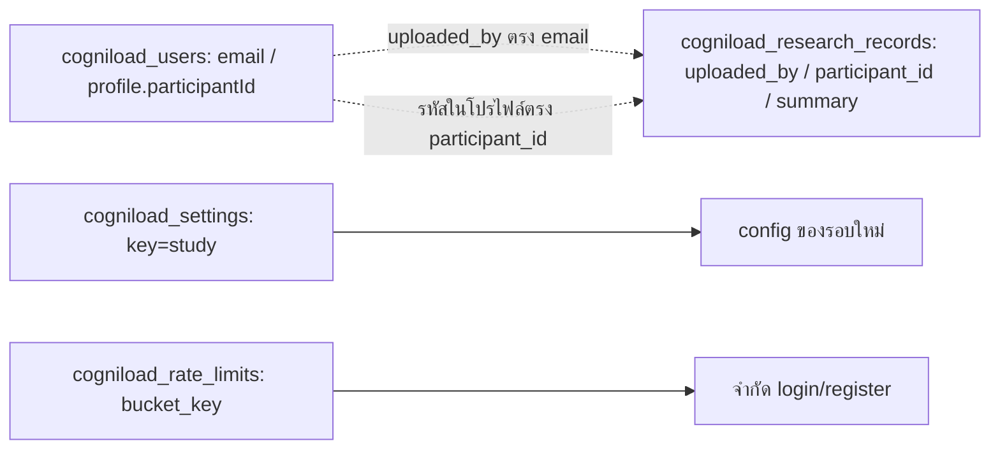

# ฐานข้อมูลและการจัดการผ่าน DBeaver

[สารบัญคู่มือ](README.md) · [API](architecture-and-api.th.md) · [ติดตั้งและย้ายข้อมูล](development-and-deployment.th.md)

บทนี้ใช้ชื่อ schema `public` ตามตัวอย่างของโปรเจกต์ ค่า host/database/username/password ต้องดูจากฐานข้อมูลของ environment ที่จะจัดการ ไม่ได้เก็บ credentials จริงในคู่มือ คำสั่งแก้ไขเป็นตัวอย่างสำหรับผู้ดูแลตรวจและรันเอง ไม่ถูกเรียกโดยการอ่านเอกสาร

## 1. Backend เลือกที่เก็บอย่างไร

`lib/server-database.js` อ่าน `DATABASE_URL` หากมีจะใช้ Neon SQL ผ่าน `@neondatabase/serverless` ถ้าไม่มีและไม่ได้อยู่บน Vercel จะคืน `null` ให้ store ใช้ JSON บน disk ถ้าอยู่บน Vercel แต่ไม่มี URL จะตอบ storage error ไม่ fallback ไป filesystem ของ deployment

มี URL แต่เชื่อมไม่ได้ก็ไม่ fallback JSON จึงไม่สร้างข้อมูลคนละชุดโดยเงียบ ๆ ฐานข้อมูลที่ local ใช้กับ Production อาจคนละฐาน ตรวจ config ก่อนแก้ข้อมูลเสมอ การอ่าน `.env.local` ของ Next กับการรัน script Node โดยตรงมีวิธีโหลด environment ต่างกัน ดูบทติดตั้ง

## 2. ตารางและชนิดข้อมูลทุกคอลัมน์

Schema ถูกสร้าง/อัปเกรดเมื่อ `getDatabase()` ถูกใช้งานครั้งแรกของ process ไม่ใช่คำสั่ง migration แยกก่อน build มีการเพิ่ม `role`, `profile` และ metadata ของโปรไฟล์ในตารางเก่า เปลี่ยน role constraint ให้รับสาม role โดยไม่เปลี่ยน role ที่ตั้งไว้อย่างชัดเจนแล้ว

### `cogniload_users`

| คอลัมน์ | Type | ข้อกำหนด/ความหมาย |
| --- | --- | --- |
| `email` | TEXT | PRIMARY KEY อีเมลบัญชี; API สร้างในรูป lowercase |
| `name` | TEXT | ชื่อแสดงผล nullable |
| `password_hash` | TEXT | NOT NULL รูป scrypt ที่แอปตรวจได้ |
| `role` | TEXT | NOT NULL DEFAULT `user`, CHECK: user/researcher/admin |
| `created_at` | TEXT | เวลา ISO; nullable ใน schema |
| `login_count` | INTEGER | NOT NULL DEFAULT 0 จำนวน login ผ่าน API สำเร็จ |
| `last_login_at` | TEXT | เวลา login ล่าสุด nullable |
| `profile` | JSONB | NOT NULL DEFAULT `{}` ข้อมูลผู้เข้าร่วม/MMSE |
| `profile_updated_at` | TEXT | ISO revision nullable ก่อนบันทึกโปรไฟล์ |
| `profile_updated_by` | TEXT | อีเมลผู้แก้ล่าสุด nullable |

Timestamp เหล่านี้เก็บเป็น TEXT ไม่ใช่ TIMESTAMPTZ การ query ช่วงเวลาจึงควร cast เมื่อจำเป็น Password ไม่ได้เข้ารหัสแบบถอดคืน แต่ hash ด้วย scrypt + salt สุ่ม; รูปแบบ `scrypt$<salt-hex>$<hash-hex>` ใช้ salt 16 bytes และ derived key 64 bytes

### รูปแบบ `profile`

```json
{
  "participantId": "P001",
  "age": 65,
  "hand": "Right",
  "sessionId": "S01",
  "studyGroup": "control",
  "education": "primary",
  "mmseScores": [5, 5, 3, 4, 2, 6, 2, 1],
  "notes": "นัดติดตามรอบถัดไป"
}
```

Keys ที่ API รับมีแปดตัวนี้เท่านั้น อายุเป็น integer 10–120 หรือ `null`; hand เป็น `Right`/`Left`/ว่าง; กลุ่ม patient/control/ว่าง; education none/primary/above/ว่าง คะแนนมีแปดช่องตาม [ตาราง MMSE](user-manual.th.md) เป็น integer ตามคะแนนเต็มหรือ `null` ด้านที่ยังไม่ประเมิน

กรณี none ด้าน index 3 และ 6 เป็น 0 หรือ null ใน input แต่รวมคะแนนจะใช้ 0 และไม่นับเป็นด้านที่ต้องกรอกเพื่อคะแนนเต็ม 23 การเลือก education ว่างแต่ใส่คะแนนใด ๆ ไม่ผ่าน API

Profile DB ไม่มี JSON schema constraint บังคับทุก key ภายใน SQL หากแก้ตรง DBeaver สามารถใส่ข้อมูลที่ API ไม่รับได้ จึงควรแก้ข้อมูลผู้เข้าร่วมผ่าน Dashboard เพื่อให้ผ่าน validation

### `cogniload_research_records`

| คอลัมน์ | Type | ข้อกำหนด/ความหมาย |
| --- | --- | --- |
| `record_id` | TEXT | PRIMARY KEY, API รับ UUID ของรอบ local |
| `participant_id` | TEXT | NOT NULL รหัสผู้เข้าร่วมจาก summary |
| `uploaded_by` | TEXT | NOT NULL อีเมลผู้ส่งจาก authenticated session |
| `uploaded_at` | TEXT | NOT NULL เวลาสร้าง server record |
| `summary` | JSONB | NOT NULL สรุป version 1 |

มี index `cogniload_research_participant_idx` บน `participant_id` ใช้ค้นตามรหัส ไม่มีตาราง raw EEG/markers ใน Neon ดู summary fields ทั้งหมดใน [บท EEG](eeg-and-data.th.md)

UUID เดิม update ได้เฉพาะเจ้าของเดิมและ participant ID เดิม `uploaded_at` ไม่เปลี่ยนเมื่อส่ง summary เดิมอีกครั้ง Session ID ที่ผู้ใช้กรอกไม่ใช่ primary key; retry เกมอาจมี `S01-G2` ซ้ำแต่ record_id ต่างกัน

### `cogniload_settings`

| คอลัมน์ | Type | ความหมาย |
| --- | --- | --- |
| `key` | TEXT PRIMARY KEY | ปัจจุบันใช้ `study` |
| `value` | JSONB NOT NULL | วัตถุ study settings |

```json
{
  "baselineSeconds": 30,
  "postTaskSeconds": 30,
  "maxTaskSeconds": 540,
  "defaultTaskSeconds": 60,
  "protocolVersion": "alz_web_games_v1"
}
```

มีแถว `study` จะใช้ค่าที่บันทึกก่อน environment ไม่มีแถวจึงใช้ defaults การกดคืนค่าเซิร์ฟเวอร์ลบเฉพาะแถว study ผ่าน API ไม่ได้ลบข้อมูลผู้ใช้/summary

### `cogniload_rate_limits`

| คอลัมน์ | Type | ความหมาย |
| --- | --- | --- |
| `bucket_key` | TEXT PRIMARY KEY | เช่น `login:<ip>`/`register:<ip>` |
| `count` | INTEGER NOT NULL | จำนวนคำขอใน window |
| `reset_at` | BIGINT NOT NULL | epoch milliseconds ของเวลาหมด window |

UPSERT เพิ่ม count หรือเริ่ม window ใหม่เมื่อหมดอายุ การล้างแถวเก่าทำเป็นครั้งคราวหลัง SQL rate-limit calls 1,000 ครั้งใน process ไม่ใช่ scheduled job ส่วน local JSON mode ใช้ Map ใน memory ไม่ได้มี JSON ของ rate limits

## 3. ความสัมพันธ์และข้อจำกัด



เส้นเชื่อมเป็นตรรกะในแอป ไม่มี foreign key/cascade ระหว่างตาราง ผู้เข้าร่วมยังไม่มีตารางแยก Email เป็นคีย์ตัวตนทั้ง account และ uploader การเปลี่ยน email โดย SQL ไม่ใช่ rename workflow ที่แอปรองรับ และอาจตัดการเชื่อมโยง summary/owner เดิม

Participant ID ไม่ unique ทั้งใน profile และ summary สามารถให้หลายนักวิจัยบันทึกรหัสเดียวกันได้ Dashboard staff กรองโดย uploader หรือรหัสใน profile จึงต้องใช้รหัสให้เป็นระบบ การแก้ participantId บน profile ไม่ rewrite summary เก่า

ไม่มี historical profile audit table: `profile_updated_at/by` แสดงเฉพาะผู้แก้ล่าสุด ไม่มี MMSE snapshot แนบทุก research record หากต้องดูคะแนน ณ วันที่ทดลองต้องจัดเก็บประวัติตามแนวทางโครงการเพิ่มเติม

## 4. ตั้งค่า DBeaver

1. สร้าง New Database Connection เลือก PostgreSQL
2. ใส่ host, port, database, username และ password จาก Neon connection details ของ environment ที่ต้องการ ปกติ port 5432
3. ตั้ง SSL mode `require` ตาม connection ของ Neon เลือก direct/unpooled endpoint สำหรับการจัดการด้วย client; ตัวแอปยังใช้ `DATABASE_URL` ของตัวเอง
4. กด Test Connection หาก driver ยังไม่มีให้ DBeaver ติดตั้ง driver ตามหน้าจอ
5. ตั้งชื่อให้แยก environment เช่น `CogniLoad Production (Neon)` หรือ `CogniLoad Preview (Neon)`
6. เปิด Schemas → public → Tables → เลือกตาราง → Data
7. เปิด SQL Editor สำหรับ SELECT/UPDATE/INSERT และตรวจว่า editor ผูก connection ถูกอัน

เครื่องที่เคยตั้งในงานนี้ใช้ชื่อ connection `CogniLoad Production (Neon)` แต่เครื่องใหม่ต้องสร้าง connection เอง `DATABASE_URL_UNPOOLED` เป็นค่าที่อาจมีจาก integration/เครื่องมือ ไม่ใช่ตัวแปรที่ runtime แอปนี้อ่านเอง

รหัสผ่าน PostgreSQL ใช้เชื่อม DB ส่วนรหัสผ่านบัญชีเว็บใช้ login และเก็บเป็น hash สองอย่างนี้ใช้แทนกันไม่ได้

ก่อนแก้ให้ตรวจ connection ด้วย:

```sql
SELECT current_database(), current_user, current_schema();
SELECT tablename
FROM pg_tables
WHERE schemaname = 'public' AND tablename LIKE 'cogniload_%'
ORDER BY tablename;
```

Data editor แก้ค่าต้องกด Save/Apply และตรวจ transaction mode ของ DBeaver ถ้า manual commit ต้อง commit ก่อนเว็บเห็นข้อมูล อย่าถือว่าค่าใน cell ที่แก้แล้วถูกบันทึกทันที

## 5. ดูบัญชีและ summary ด้วย SQL

เลือกคอลัมน์เฉพาะงานเพื่อไม่ export password hash โดยไม่จำเป็น:

```sql
SELECT email, name, role, created_at, login_count, last_login_at,
       profile, profile_updated_at, profile_updated_by
FROM public.cogniload_users
ORDER BY email;
```

ดูข้อมูลใน JSONB:

```sql
SELECT email,
       profile->>'participantId' AS participant_id,
       profile->>'age' AS age,
       profile->>'studyGroup' AS study_group,
       profile->>'education' AS education,
       profile->'mmseScores' AS mmse_scores
FROM public.cogniload_users
ORDER BY email;
```

ดูสรุปตามรหัสผู้เข้าร่วม:

```sql
SELECT record_id, participant_id, uploaded_by, uploaded_at,
       summary->>'sessionId' AS session_id,
       summary->>'gameId' AS game_id,
       summary->>'status' AS status,
       summary->>'protocolVersion' AS protocol,
       summary->>'durationSeconds' AS duration_seconds,
       summary->'game' AS game
FROM public.cogniload_research_records
WHERE participant_id = 'P001'
ORDER BY (summary->>'startedMs')::bigint DESC;
```

ตรวจจำนวนแถวและการตั้งค่า:

```sql
SELECT 'users' AS kind, COUNT(*) AS rows FROM public.cogniload_users
UNION ALL
SELECT 'research_records', COUNT(*) FROM public.cogniload_research_records;

SELECT key, value FROM public.cogniload_settings WHERE key = 'study';
```

SELECT เหล่านี้อ่านข้อมูลตามสิทธิ์ PostgreSQL ไม่ผ่านข้อจำกัด role ของเว็บ ผู้ที่เข้าถึง DB จึงอาจเห็นมากกว่าผู้ใช้เว็บทั่วไป

## 6. เปลี่ยนสิทธิ์บัญชีที่มีอยู่

แทนอีเมลตัวอย่างด้วยอีเมล lowercase ที่มีจริง รันเฉพาะคำสั่งสำหรับ role ที่ต้องการ:

```sql
UPDATE public.cogniload_users
SET role = 'researcher'
WHERE email = 'researcher@example.org'
RETURNING email, name, role;
```

```sql
UPDATE public.cogniload_users
SET role = 'admin'
WHERE email = 'admin@example.org'
RETURNING email, name, role;
```

```sql
UPDATE public.cogniload_users
SET role = 'user'
WHERE email = 'researcher@example.org'
RETURNING email, name, role;
```

ถ้า RETURNING ไม่มีแถวคือไม่พบอีเมลนั้น ไม่ได้สร้างบัญชีใหม่ Role change ไม่ต้อง commit code/deploy API ตรวจ role ใหม่จาก DB ทุกคำขอ มีผลกับ session ที่ login อยู่แล้ว เมนู UI ยังอาจค้างจน reload/login ใหม่ แต่ server จะอนุญาต/ปฏิเสธตาม role ปัจจุบัน

## 7. เพิ่มบัญชี admin/นักวิจัยจากฐานข้อมูลเท่านั้น

ไม่ต้องเปิด Register เพื่อสร้าง staff ทำตามขั้นตอนนี้จาก root โปรเจกต์บนเครื่องผู้ดูแลที่มี Node และ dependencies:

### 7.1 สร้าง password hash ด้วยฟังก์ชันของโปรเจกต์

คำสั่งต่อไปนี้ถามรหัสผ่านทาง terminal แล้วพิมพ์เฉพาะ hash ไม่ใส่รหัสผ่านใน command history ช่อง terminal จะแสดงข้อความที่พิมพ์ตามพฤติกรรม readline จึงใช้ terminal ส่วนตัว:

```bash
node --input-type=module -e '
import { createInterface } from "node:readline/promises";
import { hashPassword } from "./lib/auth/password.js";
const prompt = createInterface({ input: process.stdin, output: process.stdout });
try {
  const password = await prompt.question("New account password (8–200 chars): ");
  if (password.length < 8 || password.length > 200) throw new Error("Password length must be 8–200");
  console.log(await hashPassword(password));
} finally {
  prompt.close();
}
'
```

ค่าที่ได้ต้องมีรูป `scrypt$...$...` แต่ละการสร้างได้ salt ต่างกันแม้ใช้รหัสผ่านเดียวกัน คัดลอก hash ไป SQL ต่อไป ห้ามใส่ plaintext หรือ PostgreSQL password ใน `password_hash`

### 7.2 เพิ่มแถวใหม่

ตัวอย่างนี้ต้องแทน `<SCRYPT_HASH>` ด้วยผลจากข้อก่อน และเปลี่ยนอีเมล/ชื่อ/role ให้ตรงงานจริง:

```sql
INSERT INTO public.cogniload_users
  (email, name, password_hash, role, created_at, login_count, profile)
VALUES
  ('researcher@example.org', 'Researcher', '<SCRYPT_HASH>', 'researcher',
   to_char(clock_timestamp() AT TIME ZONE 'UTC', 'YYYY-MM-DD"T"HH24:MI:SS.MS"Z"'),
   0, '{}'::jsonb)
RETURNING email, name, role, created_at;
```

ต้องการ admin เปลี่ยน role ใน VALUES เป็น `admin` ตัวอย่างใช้ INSERT ปกติเพื่อให้ email ซ้ำเป็น error และไม่เขียนทับรหัสผ่านเดิมโดยไม่ตั้งใจ จากนั้นบันทึก transaction ตรวจ SELECT แถว และลอง login ผ่านเว็บ environment เดียวกัน

ถ้ายังไม่มีตาราง ให้ตั้ง DATABASE_URL และเปิด `/api/config` ของแอปเพื่อให้ schema initialization ทำงานก่อน อย่าสร้าง schema คนละรูปแบบจากความจำ

### 7.3 Reset รหัสผ่าน

สร้าง hash ใหม่ด้วยขั้นตอน 7.1 แล้วอัปเดตเฉพาะบัญชีที่เลือก:

```sql
UPDATE public.cogniload_users
SET password_hash = '<NEW_SCRYPT_HASH>'
WHERE email = 'researcher@example.org'
RETURNING email, role;
```

การเปลี่ยน hash ไม่ทำให้ session cookie ที่ออกไปแล้วหมดอายุทันที ระบบไม่มี session table/revocation version ถ้าต้องหยุดสิทธิ์ staff ทันทีให้ downgrade role; หากต้องหยุดใช้บัญชีทั้งหมด การลบ account ทำให้ authorize ไม่พบ แต่ต้องพิจารณา record ที่เชื่อมอยู่ก่อน

## 8. แก้โปรไฟล์โดยตรงเมื่อจำเป็น

Dashboard เป็นทางหลักที่ตรวจรูปแบบ/revision อัตโนมัติ หากแก้ SQL ต้องรักษา schema ของ JSONB และเปลี่ยน metadata ด้วยเพื่อให้ draft เก่าได้รับ conflict ตัวอย่างแก้เฉพาะ notes ของบัญชีที่เลือกพร้อม revision ที่อ่านมาก่อน:

```sql
UPDATE public.cogniload_users
SET profile = jsonb_set(profile, '{notes}', to_jsonb('นัดติดตามรอบถัดไป'::text), true),
    profile_updated_at = to_char(clock_timestamp() AT TIME ZONE 'UTC', 'YYYY-MM-DD"T"HH24:MI:SS.MS"Z"'),
    profile_updated_by = 'db-admin@example.org'
WHERE email = 'participant@example.org'
  AND profile_updated_at IS NOT DISTINCT FROM NULL
RETURNING email, profile, profile_updated_at, profile_updated_by;
```

เงื่อนไข NULL ใช้เฉพาะแถวที่ยังไม่เคยมี revision ถ้ามี revision แล้ว ให้แทน NULL ด้วย string ISO ที่ SELECT มา หากไม่คืนแถวให้ตรวจ revision ล่าสุด ไม่ข้ามเงื่อนไขเพื่อฝืนเขียนทับโดยไม่ตรวจ

Metadata นี้เก็บผู้แก้ล่าสุด ไม่ใช่ log การเปลี่ยนทั้งหมด การแก้ผ่าน SQL ข้ามการตรวจความยาว/คะแนนของ API ผู้ดูแลต้องตรวจค่าตามบทนี้ก่อน

## 9. การลบและผลต่อข้อมูลอื่น

UI ไม่มีปุ่มลบบัญชีหรือ server summary การลบ local session/raw ในห้องทดลองไม่ลบ Neon record ถ้าต้องจัดการ retention ของ server ให้ทำเป็นงาน DB ที่ตรวจรหัสและ backup ไว้แล้ว

ลบ users ไม่มี foreign key cascade ลบ research records อัตโนมัติ บัญชีเดิมที่หายจะ authorize ไม่ผ่าน แต่ summary ยังคง uploaded_by เดิม การสร้างบัญชีใหม่ด้วยอีเมลเดิมอาจอ่าน summary ที่ผูก email นั้นได้อีก ไม่มี account UUID แยกอายุบัญชี

หลีกเลี่ยงเปลี่ยนอีเมล/participant ID/record ID ของ summary โดยตรงเพียงเพื่อให้หน้าเว็บแสดงตามต้องการ เพราะ metadata และตัวตนที่ local sync จำไว้อาจไม่ตรงกัน ควรตรวจผลกระทบต่อ owner, filters, CSV และงานวิจัยก่อนเปลี่ยนคีย์

## 10. สำรองฐานข้อมูลและตรวจคืนข้อมูล

สำหรับ Postgres ใช้เครื่องมือ backup/export ของ DBeaver หรือเครื่องมือของฐานข้อมูล โดยเลือก schema/tables ของ environment ที่ถูกต้อง หากต้อง backup แบบ restore กลับทั้งโครงสร้าง ให้ใช้ native PostgreSQL backup เช่น custom-format dump และตรวจว่า client utilities ติดตั้งแล้ว

CSV export ของ Data grid ใช้เปิดอ่าน/วิเคราะห์ แต่ไม่เท่ากับ full database backup ที่เก็บ constraint/index/type ครบ สำรองทั้ง users (รวม hashes), research records, settings และ metadata ถ้าต้องคืนระบบได้ ส่วน rate limits เป็นข้อมูลการทำงานชั่วคราว

ตรวจ restore ในฐานข้อมูลทดสอบก่อนใช้งานจริง: จำนวน users/records, role, password login, JSONB profile, settings, summary ราย participant และ timestamps Browser raw EEG และ localStorage ต้องสำรองไฟล์แยกเพราะไม่อยู่ใน dump ของ Neon

ถ้าใช้ local JSON ให้หยุด server ก่อนคัดลอก `users.json`, `research-summaries.json`, `study-settings.json` และ `session-secret` รวมโฟลเดอร์ที่ override ไว้ การคืน secret เดิมช่วยให้ session ที่ยังไม่หมดอายุใช้ลายเซ็นเดิมได้ แต่ไม่แทนการตรวจบัญชี/สิทธิ์ปัจจุบัน
