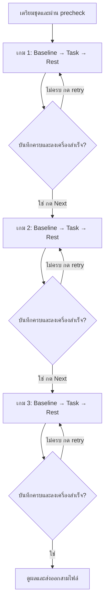

# EEG เกม และรูปแบบข้อมูล

[สารบัญคู่มือ](README.md) · [การใช้งานหน้าจอ](user-manual.th.md) · [ฐานข้อมูล](database-admin.th.md)

บทนี้อธิบายข้อมูลที่ระบบบันทึกและวิธีอ่านเพื่อส่งต่อการวิเคราะห์ อ้างอิง implementation ใน `app/page.js`, `ResearchSession.js`, `researchStorage.js`, `lib/muse/eeg-client.mjs`, `lib/research-summary.mjs` และ script ตรวจ CSV

## 1. Muse Classic และขั้นตอนเชื่อมต่อ

Driver `muse-jsx` ถูก bundle กับเว็บและโหลดด้วย dynamic import ไม่ต้องโหลดจาก CDN ภายนอก ตัว adapter ของโปรเจกต์ใช้คำสั่งและการประมาณเวลาของ `MuseClient` เดิม แต่เปิดเฉพาะ control กับ EEG สี่ช่องที่แอปใช้ ไม่บังคับ telemetry, accelerometer หรือ gyroscope

| รายการ | UUID |
| --- | --- |
| Muse service | `0000fe8d-0000-1000-8000-00805f9b34fb` |
| Control | `273e0001-4c4d-454d-96be-f03bac821358` |
| EEG TP9 / electrode 0 | `273e0003-4c4d-454d-96be-f03bac821358` |
| EEG AF7 / electrode 1 | `273e0004-4c4d-454d-96be-f03bac821358` |
| EEG AF8 / electrode 2 | `273e0005-4c4d-454d-96be-f03bac821358` |
| EEG TP10 / electrode 3 | `273e0006-4c4d-454d-96be-f03bac821358` |

ลำดับที่ทำจริง:

1. ผู้ใช้กด Connect จึงเรียก `requestDevice()` ใน user gesture กรองชื่อขึ้นต้น `Muse` และขอ optional service ของ Muse
2. เชื่อม GATT ของเครื่องที่เลือก แล้วค้น Muse service
3. ค้น control และ EEG ทั้งสี่ characteristic ให้ครบก่อนเปิด EEG notifications
4. เปิด control notifications และแต่ละ EEG notification ตามลำดับ ผูก listener และ subscriber ก่อนสั่งเริ่ม
5. สั่ง `h`, `s`, `p21`, `d` ตาม startup ของ MuseClient ที่ใช้อยู่
6. รับ packet แยกช่อง แปลงเป็น sample แล้วส่ง event ให้ ResearchSession และจอสด

เมื่อ discovery ได้ `NotFoundError` จะลองสูงสุดสามครั้ง โดยรอ 250 และ 500 ms ก่อนครั้งถัดไป GATT/network error หรือ notification error ไม่ได้ถูกเปลี่ยนเป็น “ไม่พบเครื่อง” ถ้าผู้ใช้เลือกเครื่องมาแล้ว เปิดรายละเอียดการเชื่อมต่อเพื่อดู Stage/UUID/Error ได้

ป้องกันการเชื่อมซ้อนด้วย lock ระหว่าง chooser และการเริ่ม EEG เมื่อ disconnect/failure จะถอด listener และ subscription เพื่อให้ลองใหม่ได้ จำ device ID ล่าสุดใน localStorage และลอง auto reconnect ได้เมื่อ browser มี `getDevices()` และเคยอนุญาตเครื่องนั้น ต้องกดเลือกใหม่หากไม่สามารถคืนสิทธิ์ได้

Adapter นี้ใช้ Classic protocol ตาม UUID/packet ข้างต้น การรองรับ Muse S Athena หรือ protocol อื่นยังไม่มีใน workflow นี้

## 2. Packet, sample และเวลา

EEG packet เป็น 20 bytes: สอง bytes แรกเป็น index 16-bit แบบ big-endian ที่เหลือเข้ารหัส sample 12-bit จำนวน 12 ค่า แปลงเป็นไมโครโวลต์ด้วย:

```text
value_uv = (adc_value − 2048) × 0.48828125
sample_interval_ms = 1000 / 256 = 3.90625
```

Decoder อ่าน `DataView` โดยเคารพ byteOffset และตรวจความยาวก่อนแปลง Electrode 0–3 จับคู่ TP9/AF7/AF8/TP10 ตามลำดับ ไม่มีช่อง AUX ใน raw workflow นี้

| เวลา | ที่มา | ใช้อย่างไร |
| --- | --- | --- |
| `startedMs`, `endedMs` | `Date.now()` ฝั่ง browser | เวลาเริ่ม/จบรอบและ summary |
| เวลา phase | `Date.now()` ณ boundary | marker และแบ่ง phase ของ sample |
| ตัวนับระยะ phase/RT | `performance.now()` | จับเวลาเดินหน้าและ RT โดยไม่อาศัย wall clock เพียงอย่างเดียว |
| `timestamp_ms` ของ EEG | `MuseClient.getTimestamp()` แล้วเพิ่ม offset 3.90625 ms ต่อ sample | เวลาประมาณของ sample ตาม packet |
| `received_at_ms` | `Date.now()` เมื่อรับ packet | เวลามาถึง host ทุก sample ใน packet เดียวใช้ค่าเดียวกัน |
| เวลา marker | นาฬิกา browser เมื่อเกิด event | เวลา phase สิ่งเร้า/ตอบ/หยุด |
| `relative_ms` | `timestamp_ms − startedMs` | อ่านเวลาสัมพันธ์กับต้นรอบ |

เวลา EEG เป็น host-clock estimate ไม่ใช่ clock ที่วัด hardware stimulus จริง การแสดงเกมผ่าน DOM/animation และเวลารับ Bluetooth มี latency ของ browser/OS การวิเคราะห์ที่ต้องการความแม่นยำระดับ hardware ต้องตรวจความคลาดเคลื่อนตามการออกแบบวิจัย

Sample ที่ timestamp ก่อนเริ่มรอบจะไม่เข้า raw แถวถูกเก็บตามลำดับรับ packet และ marker ไม่ได้ sort ทุกช่องด้วย timestamp ก่อน export หากต้องวิเคราะห์ข้ามช่อง/เหตุการณ์ให้จัดลำดับและตรวจ packet index เพิ่ม

## 3. ความพร้อมและคุณภาพเบื้องต้น

เริ่มรอบวิจัยต้องผ่านทุกข้อ: login, โหลด/ตรวจ config ล่าสุดได้, ฟอร์มครบ, ยืนยัน consent, IndexedDB พร้อม, ทั้งสี่ช่องมี packet ล่าสุดไม่เกินสามวินาที, มีอย่างน้อย 256 finite sample ต่อช่องในหน้าต่างย้อนหลังสามวินาที และ sample ที่ชน ADC limit น้อยกว่า 1% ทุกช่อง

คำว่า “อย่างน้อยหนึ่งวินาที” บนจอหมายถึงจำนวน sample ขั้นต่ำ 256 ในหน้าต่างตรวจ ไม่ใช่การตรวจว่าทุกช่วง sample spacing สม่ำเสมออย่างไม่มี gap Device test ข้ามเงื่อนไข consent/จำนวน sample ขั้นต่ำ/clipping แต่ยังต้องรับครบสี่ช่องและบันทึกในเครื่องได้

### Clipping

นับ sample ที่ ≤−999.5 หรือ ≥999.5 µV เป็น rail sample ช่วงเริ่มรอบตรวจข้อมูลล่าสุด; ระหว่างและหลังรอบแสดงยอดรวม/เปอร์เซ็นต์ ช่องใด ≥1% จะแสดงเตือน หลังเริ่มแล้ว clipping ไม่ได้หยุดรอบเอง จึงอาจมีสถานะ complete พร้อมเตือนคุณภาพ ต้องตรวจแยก

### สัญญาณใกล้ 50 Hz

ใช้หน้าต่าง 512 samples หรือสองวินาทีที่ 256 Hz คำนวณค่าเฉลี่ย SD และองค์ประกอบ 50 Hz แบบ sine/cosine projection Flag เมื่อ amplitude ≥15 µV และสัดส่วน variance ≥25% แสดงคำเตือนเบื้องต้นให้ตรวจ contact/สภาพแวดล้อม ไม่ใช่ notch filter ไม่ใช่เกณฑ์ EEG ทางคลินิก และไม่แก้ raw ที่ส่งออก

### Packet integrity

ตรวจ index 16-bit แยกช่องแบบ modulo 65,536:

| ผลต่าง index (`gap`) | สิ่งที่นับในรอบ |
| --- | --- |
| 0 | duplicate packet |
| 1 | ต่อเนื่อง |
| 2–1023 | missing packets เพิ่ม `gap − 1` |
| ≥1024 | reordered/out-of-order packet |

นี่เป็น heuristic ของ index ไม่ใช่หลักฐานว่า packet หายทุกกรณี การ reset ของเครื่อง/ข้อมูลล่าช้าผิดปกติอาจทำให้ตัวนับคลาดเคลื่อน ระบบนับและเก็บแถวที่รับได้ ไม่ deduplicate หรือ interpolate raw ให้อัตโนมัติ

กราฟสดแสดง buffer ล่าสุดสูงสุด 500 จุด/ช่อง ลบค่าเฉลี่ยและปรับสเกลอย่างน้อย ±20 µV หรือประมาณ 3 SD ของ buffer เพื่อการวาดเท่านั้น

## 4. ชุดทดลองสามเกมและสถานะ

หนึ่งชุดมี `sequenceId` หนึ่งค่าและสามรอบเกม แต่ละรอบมี `id` UUID ของตัวเอง `sessionId` ต่อท้าย `-G1`/`-G2`/`-G3` ค่า sequence ใช้ใน IndexedDB เพื่อเดินหน้าหรือ retry ส่วน summary ที่ส่ง server ไม่ได้เก็บ sequenceId/baseSessionId



Task ใช้เวลาสูงสุดที่ตั้ง แต่กดจบก่อนแล้วเก็บ Rest ต่อได้ ตัวนับเวลาใช้ performance clock; summary และ phase timing ใช้ wall-clock boundaries จึงมีทศนิยมและคลาดจากเวลาตั้งเล็กน้อย Total planned ต่อเกม ≤600 วินาที

Next ปลดล็อกเมื่อ record เกมปัจจุบันถูกบันทึกลง IndexedDB แล้ว ตรวจ account, sequence, game order และสถานะซ้ำจาก records ก่อนเริ่มถัดไป ข้อมูลอีกบัญชี/ชุดอื่น/device test ไม่ปลดล็อกเกม Retry สร้าง record ใหม่และไม่ทิ้งรอบไม่ครบ

| สถานะ | สาเหตุ/ความหมาย | Summary sync |
| --- | --- | --- |
| `idle` | UI พร้อมเตรียม ไม่มีรอบปัจจุบัน | ไม่มี record |
| `recording` | กำลังรับข้อมูลในรอบ | รอให้จบก่อน |
| `complete` | ผ่าน baseline/task/rest ครบ | ได้ |
| `stopped` | ผู้ใช้กดหยุด | ได้ |
| `disconnect` | ได้ event ว่า Muse disconnect | ได้ |
| `signal_lost` | ช่องใดไม่มีข้อมูลเกินสามวินาทีขณะบันทึก | ได้ |
| `hidden` | tab hidden/pagehide | ได้ |
| `task_screen_left` | พยายามออกจากหน้าเกมระหว่าง Task | ได้ |
| `task_not_started` | จบ Task แต่ไม่มี marker เริ่มเกมที่เลือก | ได้ |
| `interrupted` | โหลดรอบ recording ค้างหลังกลับมาเปิดใหม่ | ได้เมื่อมี summary สอดคล้อง |
| `storage_error` | เขียน IndexedDB ล้มเหลว ระบบหยุดรับเข้ารอบ | API ไม่รับสถานะนี้ ต้องส่งออกที่ยังอยู่ในแท็บและตรวจข้อมูล |

`complete` ไม่รับรองคุณภาพและไม่หมายความว่าทุก trial มีคำตอบ ไม่มีการนำรอบไม่ครบไปต่อจาก sample จุดเดิม

## 5. Marker ที่ระบบสร้าง

| Marker | เมื่อเกิด |
| --- | --- |
| `session_start` | เริ่มรอบ |
| `baseline_start`, `baseline_end` | เริ่ม/จบพักนิ่ง |
| `task_start`, `task_end` | เริ่ม/จบกิจกรรม |
| `rest_start`, `rest_end` | เริ่ม/จบพักหลังงาน |
| `session_complete` | จบทุกช่วง |
| `session_stopped` | หยุดเอง |
| `device_disconnected`, `signal_lost`, `tab_hidden` | หยุดจากเครื่อง/สัญญาณ/แท็บ |
| `task_screen_left`, `task_not_started` | หยุดจากเงื่อนไขเกม |
| `game_<n>_start` | เริ่มเกมที่เลือก |
| `game_<n>_trial_<t>_stimulus_<value>` | แสดงสิ่งเร้า |
| `game_2_trial_<t>_response_prompt` | Echo เปิดให้ตอบ |
| `game_<n>_trial_<t>_response_<answer>_<correct|incorrect>_rt_<ms>ms` | รับคำตอบหนึ่งครั้ง |
| `game_<n>_end_trials_<count>_correct_<count>_errors_<count>_mean_rt_<ms>ms` | ผลรวมคำตอบเมื่อจบเกม |

ตัวอย่างหนึ่ง trial ของเกมแรก:

```text
game_1_start
game_1_trial_1_stimulus_7
game_1_trial_1_response_ODD_correct_rt_540ms
game_1_end_trials_1_correct_1_errors_0_mean_rt_540ms
```

Marker ผู้ใช้เพิ่มได้ด้วยช่อง marker ไม่เกิน 80 ตัวอักษรตาม input ส่วน marker จาก event ที่รับเข้า recorder ตัดที่ 120 ตัวอักษร Phase ของ marker ใช้ phase ปัจจุบัน เกมสร้าง marker อัตโนมัติในโหมดวิจัย; โหมดฝึกไม่ได้มี recorder เก็บ event

`trials` ใน game summary หมายถึง **จำนวนครั้งที่ตอบ** ไม่ใช่จำนวนสิ่งเร้าทั้งหมด RT ของ Echo เริ่มหลังแสดงเลขครบ 2.2 วินาที ต่างจากเกมอื่น Variability บนหน้าจอไม่ได้รวมอยู่ใน server game summary ปัจจุบัน

## 6. IndexedDB และการกู้ข้อมูล

ชื่อ DB `cogniload-muse-research`, version 1:

| Object store | Key | เก็บ |
| --- | --- | --- |
| `sessions` | `id` | เจ้าของ รหัสผู้เข้าร่วม/รอบ sequence เวลา counters สถานะ summary และสถานะ sync/export/rawDeleted |
| `chunks` | `[sessionId, sequence]` | raw แถว CSV ของ record เป็นชุดเรียงลำดับ มี index `sessionId` |

เขียน sessions และ chunks ใน readwrite transaction เดียวกันแต่ละ batch เมื่อมี ≥512 แถว หรือ force flush ประมาณทุกหนึ่งวินาที และตอนจบรอบ มี write queue เรียง batch เพื่อไม่เขียนสลับลำดับ เมื่อจบต้อง persist สำเร็จจึงส่ง event ให้ UI เปิด Next และ sync

Crash กะทันหันอาจเสียข้อมูลส่วนที่ยังไม่ flush ประมาณหนึ่งวินาทีหรือมากกว่านั้นถ้า write queue/OS ยังไม่เสร็จ เป็น batch persistence ไม่ใช่การรับรองว่าข้อมูลทุก packet ลง disk ทันที

เปิดรอบค้างใหม่จะกู้ batch ที่มี เปลี่ยน `recording` เป็น `interrupted` ใช้ packet ล่าสุดเป็นเวลาสิ้นสุด สรุปใหม่ และเสนอส่งออก/retry Sequence ที่เคยเก็บอยู่กู้เพื่อเดินต่อได้แต่ไม่ต่อ raw กลางเกม

ระบบกรอง local session ตาม owner (`ownerEmail` หรือ owner เก่าจาก `serverSyncedBy`) รอบที่ไม่มี owner ไม่ sync อัตโนมัติ Admin ที่ใช้เครื่องนั้นเปิดตรวจและ “รับช่วงเข้าบัญชีนี้” ได้หลังตรวจว่าเป็นรอบตนเอง ถ้ารอบ recording มี packet ใน 60 วินาทีล่าสุดจะปฏิเสธเพราะอาจยัง active อีกแท็บ การรับช่วงนี้ไม่เลือกมอบให้อีเมล arbitrary ผ่าน UI

IndexedDB ไม่อยู่ใน Neon backup การ clear site data, ใช้ private mode, เปลี่ยน browser profile/origin หรือข้อจำกัดพื้นที่ browser อาจทำให้ข้อมูลหาย/อ่านไม่ได้ ต้องสำรอง raw CSV แยก

## 7. CSV EEG: ทุกคอลัมน์

ชื่อไฟล์ `muse_<participant>_<session>_<started-at-ISO>.csv` ชื่อส่วนรหัสถูกทำให้เหมาะกับชื่อไฟล์ เป็น UTF-8 มี BOM, CRLF, header หนึ่งบรรทัด และหนึ่งแถวต่อ sample **หรือ** marker การส่งออกใช้ metadata prefix เดียวกันทุกแถว

| คอลัมน์ | ความหมาย |
| --- | --- |
| `participant_id` | รหัสผู้เข้าร่วม |
| `session_id` | รหัสเกมในชุด เช่น `S01-G1` หรือรหัส check |
| `study_group` | `patient`/`control` หรือ `device_test` |
| `game_id` | 1–3; device test export เป็นว่าง เพราะไม่มีเกม |
| `protocol_version` | protocol ณ เริ่มรอบ หรือ `device_check_v1` |
| `condition` | เงื่อนไขหรือ `device-check` |
| `task_name` | ชื่อเกม หรือ `system-test` |
| `started_at_iso` | เวลาเริ่มรูป ISO UTC |
| `test_mode` | `true` สำหรับ device check |
| `consent_confirmed` | รอบวิจัย `true`, device test `false` |
| `sample_rate_hz` | 256 ตามโปรโตคอล |
| `baseline_seconds` | ระยะ baseline ที่ตั้ง |
| `task_seconds` | Task ที่ตั้ง; ถ้าจบ Task ปกติ/กดจบ จะเปลี่ยนเป็นเวลาจริงของ Task |
| `rest_seconds` | ระยะ Rest ที่ตั้ง |
| `record_type` | `eeg` หรือ `event` |
| `timestamp_ms` | timestamp sample/เหตุการณ์ |
| `relative_ms` | เวลาจากต้นรอบ หน่วย ms |
| `phase` | `baseline`/`task`/`rest` |
| `channel` | TP9/AF7/AF8/TP10 สำหรับ EEG; event ว่าง |
| `electrode` | 0–3 สำหรับ EEG; event ว่าง |
| `packet_index` | index 16-bit; event ว่าง |
| `sample_index` | 0–11 ภายใน packet; event ว่าง |
| `value_uv` | raw sample µV; event ว่าง |
| `marker` | event label; EEG ว่าง |
| `received_at_ms` | เวลารับ packet หรือเวลาสร้าง marker |

สำหรับรอบที่หยุดกลาง phase ค่า duration ใน raw metadata อาจยังเป็นเวลาตั้ง ไม่ใช่เวลาที่ทำจริงทั้งหมด ให้ใช้ marker/เวลาเริ่มจบและ summary duration ร่วมกัน อย่าสรุปว่ารอบครบจาก `baseline_seconds + task_seconds + rest_seconds` ใน raw เพียงอย่างเดียว

ตัวอย่างรูปแบบแถว ยกเฉพาะส่วนท้ายเพื่ออ่านง่าย:

```csv
record_type,timestamp_ms,relative_ms,phase,channel,electrode,packet_index,sample_index,value_uv,marker,received_at_ms
"eeg","1790793220000.000","0.000","baseline","TP9","0","123","0","12.20703125","","1790793220008"
"event","1790793250000","30000","task","","","","","","task_start","1790793250000"
```

ตัวอย่างนี้อธิบายแถวท้ายเท่านั้น ไม่ใช่ไฟล์ครบที่ส่งให้ validator ได้

## 8. Summary ในเครื่องและบน server

`summarizeResearchSession()` สร้าง summary version 1 ตามเวลาจริงและ counter ที่มี:

| ฟิลด์ | วิธีอ่าน |
| --- | --- |
| `version` | 1 |
| `startedMs`, `endedMs`, `status`, `testMode` | เวลา/สถานะรอบ |
| `participant`, `sessionId`, `studyGroup`, `condition`, `protocolVersion`, `gameId` | metadata ทดลอง |
| `durationSeconds` | เวลารวมจริง |
| `baselineSeconds`, `taskSeconds`, `restSeconds` | เวลาแต่ละช่วงจาก phase boundaries |
| `samples`, `channelSamples` | จำนวนรวม/สี่ช่อง |
| `averageHzPerChannel` | `samples ÷ 4 ÷ durationSeconds` ไม่ใช่ค่าแยกช่อง |
| `clippedSamples`, `clippedPercent` | รวม rail sample ทุกช่อง / เปอร์เซ็นต์รวม |
| `missingPackets`, `duplicatePackets`, `reorderedPackets` | counter รวมสี่ช่อง |
| `markers` | จำนวน event |
| `game` | ผลเกมหรือ `null` |

`game` มี `gameId`, `trials`, `correct`, `errors`, `accuracyPercent`, `meanRtMs` ถ้าไม่มีคำตอบ accuracy/RT เป็น `null` Server ไม่ได้รับ raw, marker labels, sequenceId, รายการ RT ทุก trial หรือ MMSE จาก workflow นี้

สรุปที่ sync ใช้ `{recordId, summary}` API ตรวจว่า UUID ถูกต้อง เวลาสอดคล้อง (เริ่มตั้งแต่ปี 2020 และไม่ล่วงหน้าเกินหนึ่งวัน ระยะไม่เกินหนึ่งชั่วโมง) สถานะเป็น finalized ผลรวม sample/phase/game ไม่ขัดกัน และ payload ≤16,384 ตาม guard ใน API ไม่ใช่การรับรองคุณภาพทางวิจัย

ส่งเมื่อเจ้าของ login และเมื่อรอบ finalized แล้ว ข้อมูล pending ยังอยู่ในเครื่อง ถ้าล้มเหลวมี Retry summary sync Record ใหม่ตั้ง uploadedBy จาก session server ไม่ยอมรับการปลอมผู้ส่งใน JSON Record UUID เดิมส่งซ้ำได้โดยเจ้าของเดิมและ participant ID เดิม แต่เปลี่ยนเจ้าของ/participant ไม่ได้ uploadedAt คงเวลาสร้าง server record เดิม

## 9. CSV สรุปทุกรอบ

ชื่อ `cogniload_session_summaries_<YYYY-MM-DD>.csv` หนึ่งแถวต่อ record จากชุดที่ตารางกำลังแสดง มีคอลัมน์ทั้งหมด:

```text
record_id, uploaded_by, started_at_iso, ended_at_iso,
participant_id, session_id, study_group, condition, protocol_version,
game_id, status, test_mode, raw_eeg_removed,
total_seconds, baseline_seconds, task_seconds, rest_seconds,
eeg_samples, tp9_samples, af7_samples, af8_samples, tp10_samples,
average_hz_per_channel, clipped_samples, clipped_percent,
missing_packets, duplicate_packets, reordered_packets, event_markers,
game_trials, game_correct, game_errors, game_accuracy_percent,
mean_reaction_ms
```

CSV จาก server เว้น `raw_eeg_removed` ว่างเพราะไม่มีข้อมูล local raw ส่วนจาก browser ใช้ true/false ป้องกันข้อความที่เริ่มอักขระ formula บางชนิดใน csvCell และ escape double quote มี BOM เพื่อเปิดภาษาไทยได้ ช่องว่างของผลเกมไม่ใช่ศูนย์

## 10. CSV แบบประเมินเดิม

`CogniLoad_assessment_export.csv` ใช้ localStorage มี `email`, `login_count` ในเครื่อง, `assessment_date`, `participant_id`, `age`, `education`, `mmse_score`, `mmse_max`, `mmse_cutoff`, `screen_positive`, `dashboard_level`, ผลเกมเดิมสามเกมแบบ accuracy/RT/errors, `eeg_recorded_at`, `eeg_packets` และ mean µV สี่ช่องของ baseline เดี่ยวถ้ามี

ไม่มี raw sample ทุกจุด ไม่ใช่ summary CSV ของ ResearchSession และไม่ใช่โปรไฟล์ MMSE ที่แก้บน server ต้องเลือกประเภทไฟล์ให้ตรงกับงานวิเคราะห์

## 11. ตรวจ CSV EEG ด้วย script

จาก root โปรเจกต์:

```bash
node scripts/validate-muse-csv.mjs "/path/to/muse_P001_S01-G1_recording.csv"
```

Script อ่านแบบ stream ตรวจ header, row, sample/channel, ค่า/เวลา, trial marker และ metadata แล้วพิมพ์ JSON report มี samples, arrivalHz, missing/duplicate, range/SD/rail/nearRail, 50 Hz windows, จำนวน sample แยก phase, marker timing, trial stimuli/responses/unanswered และ errors/warnings

| Exit code | หมายความว่า |
| --- | --- |
| 0 | ประมวลผลได้และไม่มี structural errors; อาจมี warnings |
| 1 | มี errors หรือเปิด/อ่านไฟล์ล้มเหลว |
| 2 | ไม่ส่ง path ไฟล์ |

รอบ complete ต้องมี marker ครบทุก phase รอบไม่ครบจะเตือนให้ดู stop marker trial มี response มากกว่าหนึ่งครั้งหรือ response ไม่มี stimulus จะเป็น error unanswered trial แสดงรายชื่อไว้ รวมกรณีถูก deadline ตัด ไม่ถูกนับเป็น error ทุกกรณี

ค่า `arrivalHz` ใช้ช่วงเวลารับ packet จึงต่างจาก `averageHzPerChannel` ใน summary ที่ใช้เวลารวมทั้งรอบ Validator มี missing/duplicate รายช่อง แต่ไม่ได้แสดง reordered counter แบบเดียวกับ live recorder ให้ตรวจ raw index เมื่อวิเคราะห์เพิ่มเติม

## 12. แนวทางจัดชุดข้อมูลเพื่อวิเคราะห์

เก็บ CSV raw สามเกมและไฟล์ summary พร้อมรหัสผู้เข้าร่วม protocol เงื่อนไข และวันทดลอง ตรวจ report ก่อนถือว่ารอบพร้อมวิเคราะห์ แยก device test กับ incomplete ออกจาก research complete ตามเกณฑ์โครงการ ใช้ record UUID แยกการ retry ที่ชื่อ `session_id` ซ้ำได้

ถ้าต้องเชื่อม MMSE ให้ใช้โปรไฟล์/ทะเบียนที่ตรวจรหัสตรงกันเอง Server profile เป็นข้อมูลปัจจุบัน ไม่ใช่ snapshot MMSE ณ วันที่ทดลอง และไม่มี foreign key บังคับ participant ID จึงต้องกำหนดวิธีใช้รหัส/เก็บประวัติภายนอกให้เหมาะกับงานวิจัย

สรุปครบช่วยตรวจความสมบูรณ์เบื้องต้น การกรองสัญญาณ epoching band power การวิเคราะห์โมเดล และการตีความทางคลินิกต้องทำด้วยกระบวนการที่ตรวจสอบเพิ่มเติมตามโครงการ
