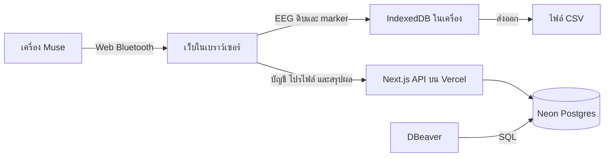

# โปรเจกต์ CogniLoad-XAI และฐานข้อมูล

Source code: [tsuna-n/cogni](https://github.com/tsuna-n/cogni) · [ดาวน์โหลดโปรเจกต์ ZIP](https://github.com/tsuna-n/cogni/archive/refs/heads/main.zip)

## โปรเจกต์ทำอะไร

CogniLoad-XAI เป็นเว็บสำหรับงานวิจัยที่ใช้ Muse 2 / Muse S บันทึก EEG สี่ช่อง TP9, AF7, AF8 และ TP10 ระหว่างช่วง baseline → เกมทดสอบ → พักหลังทดสอบ พร้อม marker เหตุการณ์และการส่งออก CSV รองรับภาษาไทยและอังกฤษ

เว็บใช้ Next.js 16.3.5, React 19 และ `muse-jsx` สำหรับเชื่อม Muse ผ่าน Web Bluetooth ฝั่ง server ใช้ Next.js Route Handlers และเชื่อม Neon Postgres ผ่าน `@neondatabase/serverless` โค้ดอยู่บน GitHub และ deploy ผ่าน Vercel

Dashboard ของ admin และนักวิจัยมีสี่แท็บ: ภาพรวมข้อมูลผู้ใช้, รายชื่อและฟอร์มแก้ไขผู้ใช้, ผลการทดลองที่ sync แล้ว และข้อมูล EEG ในเครื่อง กราฟผู้ใช้คำนวณจากโปรไฟล์ที่บันทึกจริง

## โครงสร้างไฟล์ที่ใช้บ่อย

| ตำแหน่ง | หน้าที่ |
| --- | --- |
| `app/page.js` | หน้าแอป, login/register, เมนูและการสลับหน้าจอ |
| `app/components/ResearchSession.js` | ควบคุมรอบทดลอง ช่วงเวลา EEG และเกม |
| `app/components/researchStorage.js` | เก็บรอบทดลองและ EEG ใน IndexedDB ของเบราว์เซอร์ |
| `app/components/DashboardUsers.js` | รายชื่อผู้ใช้ การค้นหา และการบันทึกโปรไฟล์ |
| `app/components/DashboardUserOverview.js` | กราฟและสถิติข้อมูลผู้ใช้ |
| `app/api/` | API สำหรับบัญชี โปรไฟล์ สรุปผล และการตั้งค่า |
| `lib/server-database.js` | เชื่อมฐานข้อมูลและสร้าง/อัปเกรด schema เมื่อมีการใช้งานครั้งแรก |
| `lib/auth/` | บัญชี, password hash, session และการตรวจสิทธิ์ |
| `lib/research/` | ตรวจข้อมูลสรุปผล จัดเก็บ และตั้งค่าโปรโตคอล |
| `scripts/migrate-local-json.mjs` | ย้ายข้อมูล JSON เข้า Postgres |
| `tests/` | ทดสอบสิทธิ์ ข้อมูลผู้ใช้ สรุปผลและการจัดเก็บ |

## ข้อมูลอยู่ที่ไหน



Production ใช้ `DATABASE_URL` ของ Vercel เชื่อม Neon ข้อมูลบัญชี โปรไฟล์ผู้เข้าร่วม สรุปผลทดลองและการตั้งค่าจึงอยู่ในฐานข้อมูลที่แยกจากตัว deployment

EEG ดิบและ marker อยู่ใน IndexedDB ของเบราว์เซอร์ที่บันทึก เมื่อ sync ระบบส่งเฉพาะสรุปผลไป Neon การเปิดเว็บจากเครื่องอื่นจึงดูสรุปที่ sync แล้วได้ตามสิทธิ์ แต่ไม่สามารถเปิด EEG ดิบของเครื่องเดิมจาก Neon ต้องใช้ไฟล์ CSV ที่ส่งออกไว้

Local development ถ้าไม่ได้ตั้ง `DATABASE_URL` จะใช้ `data/users.json`, `data/research-summaries.json` และ `data/study-settings.json` หรือโฟลเดอร์ที่กำหนดด้วย `COGNILOAD_DATA_DIR` ส่วน `RESEARCH_DATA_DIR` เป็นตัวเลือกเดิมสำหรับสรุปผลทดลองเท่านั้น Local และ Production ไม่ได้ sync บัญชีหรือโปรไฟล์ให้กันอัตโนมัติ บน Vercel ระบบกำหนดให้ใช้ฐานข้อมูลและไม่เปลี่ยนไปใช้ JSON หากเชื่อมต่อไม่ได้

## ตารางในฐานข้อมูล

| ตาราง | เก็บอะไร | คีย์หลัก |
| --- | --- | --- |
| `cogniload_users` | บัญชี สิทธิ์ ข้อมูลผู้เข้าร่วม และประวัติการแก้ไขโปรไฟล์ | `email` |
| `cogniload_research_records` | สรุปผลแต่ละรอบทดลอง ผู้ส่งข้อมูล และเวลาที่ sync | `record_id` |
| `cogniload_settings` | การตั้งค่าเวลาทดลองและโปรโตคอลในรูป JSON | `key` |
| `cogniload_rate_limits` | ตัวนับคำขอ เช่น login/register ภายในช่วงเวลา | `bucket_key` |

### บัญชีและโปรไฟล์: `cogniload_users`

| คอลัมน์ | ความหมาย |
| --- | --- |
| `email` | อีเมลที่ใช้ login และระบุบัญชีแบบไม่ซ้ำ |
| `name` | ชื่อที่แสดงในระบบ |
| `password_hash` | รหัสผ่านที่ผ่าน scrypt ในรูป `scrypt$salt$hash` |
| `role` | สิทธิ์ `user`, `researcher` หรือ `admin` ค่าเริ่มต้นเป็น `user` |
| `created_at` | เวลาสร้างบัญชี เก็บเป็นข้อความเวลา |
| `login_count`, `last_login_at` | จำนวนครั้งและเวลาที่ login ล่าสุด |
| `profile` | JSONB ของข้อมูลผู้เข้าร่วม |
| `profile_updated_at`, `profile_updated_by` | เวลาที่แก้ไขโปรไฟล์และอีเมลของผู้แก้ไข |

ตัวอย่าง `profile` ที่ยังไม่ได้ประเมิน MMSE:

```json
{
  "participantId": "P001",
  "age": 65,
  "hand": "Right",
  "sessionId": "S01",
  "studyGroup": "control",
  "education": "primary",
  "mmseScores": [null, null, null, null, null, null, null, null],
  "notes": "นัดติดตามผลครั้งถัดไป"
}
```

`studyGroup` ใช้ `patient` หรือ `control`; `education` ใช้ `none`, `primary` หรือ `above` และปล่อยว่างได้ถ้ายังไม่ได้บันทึก คะแนน MMSE เก็บแปดด้านตามฟอร์ม ใช้ `null` สำหรับด้านที่ยังไม่ได้ประเมิน คะแนนเต็ม 30 หรือ 23 ตามระดับการศึกษา อายุที่กรอกต้องเป็นจำนวนเต็ม 10–120 ปี

ปัจจุบันโปรไฟล์ผูกกับบัญชีผู้ใช้ ไม่มีตารางผู้เข้าร่วมแยกต่างหาก `profile.participantId` และ `cogniload_research_records.participant_id` ใช้เชื่อมโยงข้อมูลในแอป ส่วน `uploaded_by` ระบุอีเมลเจ้าของสรุปผล Schema ยังไม่ได้ประกาศ foreign key ระหว่างตารางเหล่านี้

API แก้ไขโปรไฟล์ตรวจ revision จาก `profile_updated_at` เพื่อป้องกันการบันทึกทับข้อมูลที่อีกคนแก้ไปแล้ว หากแก้ `profile` โดยตรงใน DBeaver ต้องกรอกข้อมูลให้ตรงรูปแบบและอัปเดต `profile_updated_at`/`profile_updated_by` ด้วย การแก้ผ่าน Dashboard จะตรวจข้อมูลและจัดการ revision ให้

### สรุปผล: `cogniload_research_records`

แต่ละแถวมี `record_id`, `participant_id`, `uploaded_by`, `uploaded_at` และ `summary` แบบ JSONB สรุปประกอบด้วยเวลาและสถานะรอบทดลอง จำนวน sample/คุณภาพสัญญาณ และผลเกมตามข้อมูลที่มี ระบบคงเจ้าของเดิมไว้และไม่อนุญาตให้อีกบัญชีเขียนทับ record ของเจ้าของอื่น

### การตั้งค่าและตัวนับคำขอ

`cogniload_settings` ใช้แถว `key = 'study'` เก็บเวลาช่วง baseline, พักหลังทดสอบ, เวลาสูงสุด/ค่าเริ่มต้นของ task และ protocol version ค่าที่ admin บันทึกมีลำดับความสำคัญก่อนค่าจาก environment

`cogniload_rate_limits` เก็บ `count` และ `reset_at` ของแต่ละ bucket เพื่อจำกัดคำขอภายในช่วงเวลา ตารางนี้เป็นข้อมูลการทำงานของระบบ

## สิทธิ์ผู้ใช้

| งาน | user | researcher | admin |
| --- | --- | --- | --- |
| ดูสรุปผลที่ตนเองส่ง | ได้ | ได้ | ได้ |
| ดู/แก้โปรไฟล์ทุกบัญชีใน Dashboard | ไม่ได้ | ได้ | ได้ |
| ดูสรุปผลที่ sync ของทุกบัญชี | ไม่ได้ | ได้ | ได้ |
| เปลี่ยนการตั้งค่าโปรโตคอลผ่านหน้า Admin | ไม่ได้ | ไม่ได้ | ได้ |
| จัดสรร EEG เก่าในเครื่องที่ยังไม่มีเจ้าของ | ไม่ได้ | ไม่ได้ | ได้ |

Register สร้าง `user` เท่านั้น การกำหนด `researcher`/`admin` ต้องทำในฐานข้อมูล ไม่สามารถเปลี่ยน role ผ่านฟอร์มโปรไฟล์ได้ API อ่าน role ปัจจุบันจากฐานข้อมูลเมื่อรับคำขอ จึงไม่ต้อง deploy ใหม่หลังเปลี่ยนสิทธิ์ หากเมนูยังแสดงสิทธิ์เดิมให้รีเฟรชหน้าหรือเข้าสู่ระบบใหม่

## จัดการผ่าน DBeaver

เครื่องที่ตั้งค่าไว้ใช้ connection **CogniLoad Production (Neon)** เปิด **Schemas → public → Tables → cogniload_users → Data** เพื่อดูบัญชี แก้ `role` แล้วกดบันทึกใน DBeaver ค่า role ของแอปต่างจากบัญชี PostgreSQL ที่ใช้เชื่อมฐานข้อมูล

SQL ดูบัญชีโดยไม่แสดง password hash:

```sql
SELECT email, name, role, created_at, login_count,
       last_login_at, profile, profile_updated_at, profile_updated_by
FROM public.cogniload_users
ORDER BY email;
```

ตัวอย่างเปลี่ยนสิทธิ์บัญชีที่มีอยู่แล้ว ให้แทนอีเมลตัวอย่างด้วยบัญชีที่ต้องการและรันเฉพาะคำสั่งนั้น:

```sql
UPDATE public.cogniload_users
SET role = 'researcher'
WHERE email = 'researcher@example.com'
RETURNING email, role;
```

ใช้ `admin` เพื่อให้สิทธิ์ผู้ดูแล หรือ `user` เพื่อคืนเป็นผู้ใช้ทั่วไป ถ้าไม่คืนแถวแสดงว่าไม่พบบัญชีอีเมลนั้น การเพิ่มบัญชีผ่าน DBeaver ต้องใส่ `password_hash` ที่สร้างด้วย `hashPassword()` ใน `lib/auth/password.js`; การใส่รหัสผ่านธรรมดาลงคอลัมน์นี้จะใช้ login ไม่ได้

ตั้ง connection ใหม่ด้วย PostgreSQL โดยใช้ host, database, username และ password จาก connection string ของ Neon พร้อม SSL mode `require` ค่ารหัสผ่านฐานข้อมูลต่างจากรหัสผ่านผู้ใช้เว็บ ให้เก็บ connection string ใน environment/ตัวจัดการ credentials และใช้ `DATABASE_URL_UNPOOLED` สำหรับ connection ที่ตั้งไว้ใน DBeaver

## เปิดโปรเจกต์และ deploy

```bash
git clone https://github.com/tsuna-n/cogni.git
cd cogni
npm ci
cp settings.example.env .env.local
npm run dev
```

ตั้งค่า `.env.local` ตาม environment ที่ต้องการใช้ ถ้าจะใช้ Neon ให้ตั้ง `DATABASE_URL` และ `SESSION_SECRET` ของ environment นั้น สำหรับ Production บน Vercel ต้องมี `DATABASE_URL` และ `SESSION_SECRET` อย่างน้อย 32 ตัวอักษร

ในโปรเจกต์ที่เชื่อม GitHub กับ Vercel แล้ว การ commit และ push ไป `main` จะเริ่ม Production autodeploy โค้ดเปลี่ยนตาม commit ส่วนข้อมูลบัญชีและผลวิจัยยังอยู่ใน Neon การสร้าง admin หรือเปลี่ยน role ด้วย DBeaver เป็นการแก้ข้อมูลฐานข้อมูล จึงไม่ใช่ไฟล์ที่จะนำไป commit

ตรวจรายละเอียดการทดลอง การย้าย JSON เข้า Neon และการตั้งค่าเพิ่มเติมใน [README](../README.md)
